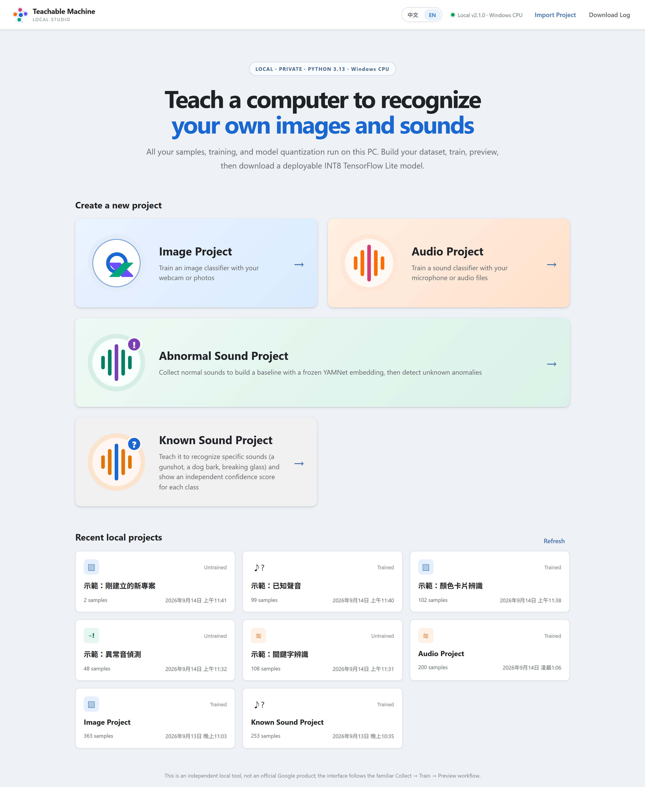
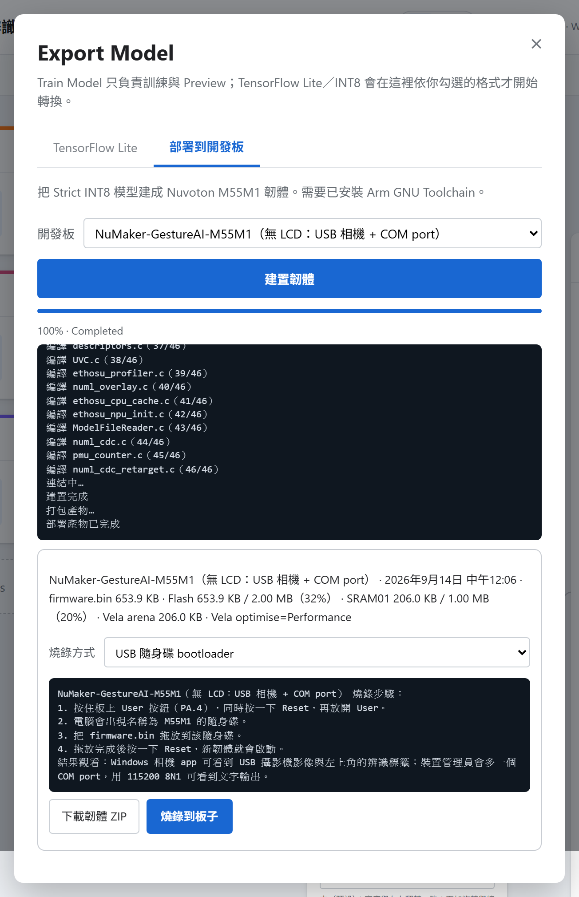
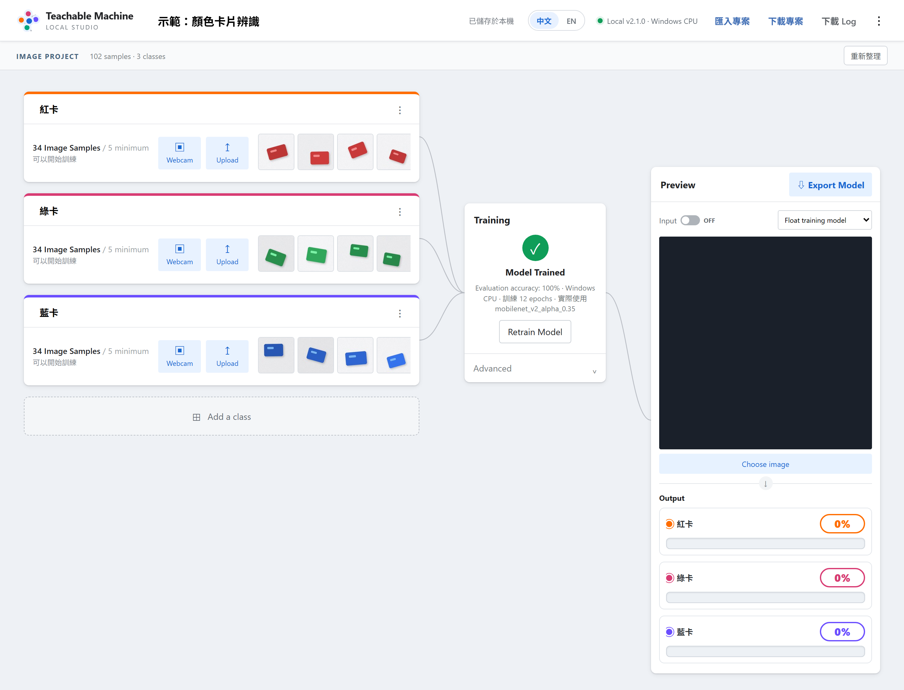

# Teachable Machine Local Studio v2.1.0 — Windows Only

這是一套在 **Windows PC 本機**執行的 Image／Audio／Abnormal Sound／Known Sound 教學式機器學習工具。學生可以在同一個網頁完成：

```text
建立類別 → Webcam／麥克風收集樣本 → 訓練 → PC Preview
→ Export Float32／Dynamic／INT8／UINT8 TensorFlow Lite
→ 建成 M55M1 開發板韌體並燒錄
```

所有樣本、模型與專案預設保存在本機 `workspace`，不需要 Google 帳號，也不會把圖片或錄音上傳到外部服務。



*圖 1：開啟 `02_START.bat` 後的首頁，可以建立四種專案，右上角能切換中文／英文介面並看到目前的 runtime。*

> **第一次使用、或想完整了解安裝、四種專案、每一個訓練參數的意義、以及怎麼燒到開發板，請直接看 [`使用手冊_zh-TW.md`](./使用手冊_zh-TW.md)。** 這份 README 只整理重點，完整說明與尚未在真實硬體上驗證過的項目都在使用手冊裡。
> 英文版使用手冊：[`USER_GUIDE_en.md`](./USER_GUIDE_en.md)。

> 本專案是獨立本機實作，不是 Google 官方產品。商標與上游授權說明請看 `NOTICE.md`。

## v2.1.0 的重點

### A. 可以把模型部署到 M55M1 開發板

Image、Audio（關鍵字／聲音分類）與 Known Sound 三種專案，都能在 Export Model 視窗的
「部署到開發板」頁籤直接建成 Nuvoton M55M1 韌體 `firmware.bin`，支援
**NuMaker-M55M1（X 板）**、**NuGestureAI-M55M1** 與 **NuMaker-VoiceAI-M55M1** 三塊板子。
VoiceAI 沒有相機也沒有 LCD，只能選 Audio 或 Known Sound；Image 專案仍只能選 X 板或 GestureAI。

```text
Train → Export（Strict INT8）→ 選開發板 → 建置韌體 → 下載 ZIP 或直接燒錄
```

- 韌體樣板、BSP 子集與 Vela 編譯器都內附在 `mcu_toolkit\`，不必另外下載 Nuvoton 工具包。
- 只需要自己安裝一次免費的 **Arm GNU Toolchain**（`.venv\Scripts\python.exe
  scripts\download_arm_toolchain.py` 可以代勞，會驗證 SHA-256）。**不需要 Keil。**
- 結果怎麼看：X 板看 LCD，GestureAI 用 Windows 相機 app 看疊字，音訊專案看 COM port
  （115200 8N1）。
- `Abnormal Sound` 沒有開發板韌體，維持電腦上使用。
- 步驟、記憶體上限、錯誤訊息與**尚未實測的項目**：`docs\MCU_DEPLOY_zh-TW.md`。



*圖 2：韌體建置完成後會列出 flash 與 SRAM 用量摘要，下面可以選燒錄方式、看到該方式的逐步說明，再直接下載韌體 ZIP 或燒錄到板子。*

### B. Advanced 面板開放更多訓練參數

每一個控制項都對應一個專案設定，改了會重新訓練：

```text
共同     目標裝置（電腦／X 板／GestureAI）
Image    資料增強強度、Dropout、MobileNetV2 微調層數、Image Size
Audio    資料增強強度、SpecAugment、Session-disjoint 驗證、背景類別與其權重、Dropout、偵測門檻、Mel Bins
Known    波形增強、分類頭 Dropout、每一類獨立門檻、背景類別與其權重、Encoder 深度
```

選了開發板之後，會改變韌體輸入契約的設定（影像尺寸、音訊前處理幾何、Encoder 深度上限）
會自動鎖成韌體支援的值，面板也只會顯示合法選項。
Image／Audio 匯出時若 INT8 與 Float 模型的 top-1 一致率低於 95%，會顯示黃色提醒。

### C. 新增 `reference\` 參考程式資料夾

四種專案各有一份可以直接執行、看得懂的精簡 Python 腳本（訓練／前處理／用 TFLite 推論），
以及 Audio 的 `mcu_tables.py`（印出韌體實際使用的 mel／Hann 表）。
總覽與參數說明見 `reference\README_zh-TW.md`。

## 沿用 v2.0.7 的設計

### 1. 完全改成原生 Windows

本版只使用：

```text
Windows 10／11
64-bit CPython 3.13
專案資料夾內的 .venv
TensorFlow 2.21 Windows CPU runtime
```

安裝器不會：

```text
安裝 Linux
安裝 WSL
要求啟動其他作業系統
安裝 CUDA 或 Linux driver
建立第二套 Linux Python 環境
```

即使電腦有 NVIDIA 顯卡，本版仍固定使用 **Windows CPU** 訓練與匯出。這是為了保持學生環境單純、可重現，而且只需要管理一個 `.venv`。

### 2. 根目錄只保留兩個 BAT

```text
01_INSTALL.bat  建立／更新 .venv，安裝並驗證套件
02_START.bat    啟動本機網站
```

不再要求學生執行多個 Verify、Smoke Test 或 GPU Setup BAT。

### 3. Image 與 Audio 百分比顯示

右側 Output 會顯示：

- 明確的大字百分比，例如 `98.7%`、`1.3%`。
- 與類別顏色一致的實心長條。
- 最高分結果加粗、加高。
- 很小但非零的分數仍保留可見標記。

### 4. Train 與 Export 分開

```text
Train Model
  → 訓練、評估、儲存 .keras
  → 立即顯示 100%
  → Preview 可用

Export Model
  → 只產生使用者勾選的 TFLite 格式
  → 獨立 worker process
  → 顯示經過時間
  → 失敗不會破壞已訓練模型與樣本
```

### 5. 單一診斷 Log

網頁右上角的「下載 Log」會產生：

```text
TM_Local_Studio_Diagnostic.txt
```

內容包含 Python／TensorFlow 版本、CPU 設定、最近的 Training／Export job、完整 traceback、`LATEST.log` 與 `LATEST_INSTALL.log`。不包含學生圖片或錄音內容。

---

# 安裝

## 先安裝 Python

```text
64-bit CPython 3.13.x
```

安裝 Python 時建議勾選：

```text
Add python.exe to PATH
```

不支援 experimental free-threaded `Python 3.13t`。

正確版本的官方安裝檔已附在 `0_Python_3.13.15\python-3.13.15-amd64.exe`，電腦上還沒有 Python 3.13 就直接執行它。

## 第一次使用

1. 將 ZIP 完整解壓縮到英文短路徑，例如：

   ```text
   C:\TM_Local_Studio
   ```

2. 雙擊：

   ```text
   01_INSTALL.bat
   ```

3. 安裝完成後雙擊：

   ```text
   02_START.bat
   ```

4. 瀏覽器會開啟：

   ```text
   http://127.0.0.1:8765
   ```

安裝器會建立：

```text
專案資料夾\.venv
```

所有訓練、Preview 與 TensorFlow Lite 匯出都使用這個 Windows `.venv`。

安裝完成後，黑色視窗應顯示：

```text
Runtime     : Windows CPU
Linux/WSL   : disabled
```

---

# 日常操作

## Image Project

1. 建立至少兩個類別。
2. 使用 Webcam 按住 `Hold to Record`，或批次 Upload 圖片。
3. 每一類建議拍攝不同角度、距離與背景。
4. 設定 Epoch、Batch Size、Learning Rate、Validation Split。
5. 按 `Train Model`。
6. 訓練完成後在 Preview 使用 Webcam 或 `Choose image` 測試。
7. 按 `Export Model` 產生需要的格式。



*圖 3：Image 專案的工作畫面。左邊建立類別、用 Webcam 或上傳收樣本，中間按下 Train Model 開始訓練（圖中模型已經訓練完成，所以按鈕顯示為 Retrain Model），右邊在 Preview 測試並匯出。*

Image 模型可選：

```text
MobileNetV2 transfer learning
small CNN
```

## Audio Project

1. 建立 Background Noise 與要辨識的聲音類別。
2. 使用麥克風錄音或 Upload 音訊。
3. 長音訊會切成固定長度樣本。
4. 每一個樣本會顯示頻譜縮圖，可播放或刪除。
5. 按 `Train Model`。
6. 使用麥克風或音訊檔 Preview。
7. 按 `Export Model` 產生 TFLite。

Audio 預設前處理：

```text
16 kHz mono PCM，1 秒
25 ms window，10 ms hop
512-point RFFT
40-bin log-mel spectrogram
輸入 shape 約 98 × 40 × 1
```

MCU 端需要重現相同前處理，詳見：

```text
docs\MCU_AUDIO_INT8_zh-TW.md
```

## Known Sound Project（YAMNet 分類器）

要「指出這是**哪一種**聲音」並看到每類百分比，用這個模式，不要用 Abnormal Sound。

```text
每類的 1 秒 clips
  → 固定 YAMNet 96 × 64 log-mel frontend
  → frozen YAMNet embedding encoder（不 fine-tune）
  → Dense(n, sigmoid)              ← 唯一可訓練層
  → 每類一個獨立分數
```

操作原則：

1. 開四個平等類別，例如 `槍聲`／`狗叫聲`／`玻璃破裂`／**`Background`**。
   `Background` 一定要收（房間底噪、講話、鍵盤、關門）；沒有它，模型會對任何聲音亂報。
2. **每一種聲音要分開錄很多次，不是錄一次很長。** 一段 20 秒切成 20 片對電腦來說
   只是**一個**例子。每類至少 2 個獨立場次、20 個片段才允許訓練。
3. 分數**彼此獨立、不會加總成 100%**；兩種聲音可以同時被偵測到。超過門檻（預設 50%）
   的類別會被標示為偵測到。這是模型在已知類別上的信心，不是真實機率。
4. 錄音／上傳後會自動做**錄音健檢**，用官方 YAMNet 告訴你「這段聽起來像什麼」。
   如果你要錄槍聲，它卻回報 `Speech`，代表麥克風收到的是人聲而不是槍聲。
5. 用喇叭播放聲音來收音時要小心：模型可能學到「喇叭在響」而不是事件本身。
   請用不同音量／距離／位置各錄幾次，有真實錄音檔就直接用「上傳」加入。

匯出為單一 TFLite（`96×64 patch → n 個獨立分數`）加 `labels.txt`，約 3.5 MiB，
定位為 Desktop／Advanced；strict INT8 通過不等於任意 MCU 可跑。
細節見 `docs/KNOWN_SOUND_zh-TW.md`。

## Abnormal Sound Project（YAMNet）

這個模式不是聲音分類器。它使用固定的 YAMNet 1024 維 embedding，從你收集的
`Normal baseline` 建立正常分布，再回報新聲音偏離正常基準的程度：

```text
16 kHz mono WAV
  → 固定 YAMNet 96 × 64 log-mel frontend
  → frozen YAMNet embedding encoder
  → Normal-only robust diagonal scorer + RMS level branch
  → anomaly ratio + temporal voting
```

操作原則：

1. 只在 `Normal baseline` 收集設備正常運作聲音；至少 3 個獨立 sessions、合計 60 秒才可建立低信心 scorer。
2. 建議跨時間、轉速、負載、距離與背景收集至少 6 個 sessions、120 秒以上。只有 calibration 證據達門檻時，Preview 才顯示正式 Normal／Abnormal；不足時仍顯示分數，但 verdict 保持 `Uncertain`。
3. `Anomaly Examples` 與後續新增群組只用於評估，永遠不會進入訓練、threshold 或 INT8 representative data。
4. 麥克風選單會優先找出 GestureAI／DMIC 裝置，並把實際 browser track settings 與 recording session 一起保存。
5. `Train Model` 只建立 normal reference／threshold 並保存 frozen `.keras` encoder；YAMNet 本身不會用少量 Normal 資料 fine-tune。

`01_INSTALL.bat` 會下載一次約 15 MB、SHA-256 固定的官方 YAMNet 權重。Train 與
Preview 不會臨時連網；資產缺少或雜湊不符時會明確停止，不會偷偷換模型。

詳細資料契約、frontend、scorer、匯出內容與限制請看：

```text
docs\ABNORMAL_SOUND_YAMNET_zh-TW.md
```

---

# Export Model

可勾選：

```text
Strict INT8 TFLite
Strict UINT8 TFLite
Float32 TFLite
Dynamic Range TFLite
C array model_data.h
```

INT8／UINT8 使用學生實際收集的平衡樣本作為 representative calibration dataset，並限制使用整數 TensorFlow Lite operators。轉換後會檢查：

- Input／Output dtype。
- Quantization scale 與 zero point。
- 全部 tensor dtype。
- TFLite operators。
- 是否含 Flex／SELECT_TF_OPS。
- Float Keras 與量化模型的 top-1 agreement／誤差。

若 strict integer 條件不成立，匯出會顯示失敗，而不是把混合 Float 模型錯誤標成 INT8。

Abnormal Sound 的 representative data 僅來自 Normal。它的 TFLite 輸出是 1024 維
embedding，不是類別機率；ZIP 會同時包含 `yamnet_scorer.json`、frontend reference
與 runner，也不會把 anomaly evaluation 群組偽裝成 `labels.txt`。Strict INT8 只證明
模型是全整數 graph，不代表任意 MCU 已有足夠 flash、SRAM 或即時效能。

## 部署到開發板

Export Model 視窗的第二個頁籤是「部署到開發板」。Image、Audio 與 Known Sound 三種專案，
可以直接建成 Nuvoton M55M1 的韌體：

1. 先安裝一次 Arm GNU Toolchain（見 `docs\MCU_DEPLOY_zh-TW.md` 第 2 節；缺少時這個頁籤會
   停用按鈕並說明缺什麼）。
2. 選開發板：`NuMaker-M55M1`（X 板）或 `NuGestureAI-M55M1`。
3. 按「建置韌體」。Studio 會自動補做 Strict INT8 匯出、用 Vela 為 Ethos-U55 編譯、組出韌體
   專案並呼叫 `arm-none-eabi-gcc`，過程中顯示進度與編譯訊息。
4. 完成後可以「下載韌體 ZIP」（內含 `firmware.bin`、燒錄說明、原始碼快照與建置報告），
   或直接按「燒錄到板子」。燒錄前會再確認一次檔名、大小與板子。

燒錄方式：GestureAI 按住 User 鍵＋Reset 進入 `M55M1` 隨身碟模式，把 `firmware.bin` 拖進去
再 Reset；X 板用 Nu-Link Command Tool（安裝檔附在 `2_Compiler and Download Tool Driver\`）或 Keil 下載。

重新訓練或改動樣本會作廢模型，連同韌體一起清掉，網頁會提示「模型已變更，請重新建置。」

記憶體上限、每種錯誤訊息的處置、Known Sound 的深度上限（X 板 12／GestureAI 11），以及
**尚未在真實硬體上實測的項目**，都寫在 `docs\MCU_DEPLOY_zh-TW.md`。

---

# 發生問題時

## 第一個動作：下載 Log

在網頁右上角按：

```text
下載 Log
```

把產生的：

```text
TM_Local_Studio_Diagnostic.txt
```

傳給負責人。

本機也保留：

```text
logs\LATEST.log
logs\LATEST_INSTALL.log
```

## `.venv` 安裝損壞

1. 關閉 Local Studio。
2. 只刪除專案根目錄的：

   ```text
   .venv
   ```

3. 重新執行：

   ```text
   01_INSTALL.bat
   ```

不要刪除 `workspace`，其中包含所有專案、圖片與錄音。

## Port 8765 已使用

```bat
netstat -ano | findstr :8765
```

只有確實看到 PID 時才是 Port 衝突。

## Export 百分比暫時不動

TensorFlow Lite 單次 `convert()` 沒有細部進度 callback，所以同一種格式轉換期間百分比可能暫時不變；畫面會持續顯示 elapsed time。超時後 worker 會被終止，不會損壞已訓練 `.keras` 模型。

---

# 重要資料夾

```text
0_Python_3.13.15\            Python 3.13 官方安裝檔（電腦沒有 Python 時先執行）
1_Collect_Firmware_bin\      讓開發板變成 USB 麥克風／攝影機、用來收樣本的韌體
2_Compiler and Download Tool Driver\   Nu-Link Command Tool 安裝檔（X 板燒錄用）
.venv\                       Windows Python 3.13 專案環境
workspace\projects\          學生專案、樣本與模型（含 models\mcu\<板子>\ 的韌體）
logs\LATEST.log              最近一次 Local Studio 執行紀錄
logs\LATEST_INSTALL.log      最近一次安裝紀錄
runtime\                     Windows CPU runtime 設定
runtime\arm-gnu-toolchain\   （選用）解壓在這裡的 Arm GNU Toolchain，Studio 會自動找到
mcu_toolkit\                 開發板韌體樣板、BSP 子集與 Vela 編譯器（隨 Studio 附上）
reference\                   四種專案的可執行參考程式（訓練／前處理／推論）
docs\                        說明文件
```

只有 `01_INSTALL.bat` 與 `02_START.bat` 是學生操作入口。
