# Teachable Machine Local Studio 使用手冊

> 版本：v2.1.0 — Windows Only。本手冊假設你完全沒有機器學習或嵌入式開發背景，只需要會用滑鼠雙擊 `.bat` 檔。
>
> English version: **[USER_GUIDE_en.md](USER_GUIDE_en.md)**

---

## 目錄

1. [這個工具是什麼](#1-這個工具是什麼)
2. [安裝](#2-安裝)
3. [四種專案怎麼選](#3-四種專案怎麼選)
4. [日常流程](#4-日常流程)
5. [參數的意義](#5-參數的意義)
6. [燒錄到開發板](#6-燒錄到開發板)
7. [出問題時](#7-出問題時)
8. [目前還沒驗證的事](#8-目前還沒驗證的事)

---

## 1. 這個工具是什麼

Teachable Machine Local Studio 是一套完全在你自己這台 Windows 電腦上執行的教學工具。你在瀏覽器裡建立一個「專案」，用 Webcam 拍照或用麥克風錄音當作教材，按下「訓練」讓電腦學會分辨這些教材，然後可以立刻在同一個網頁裡測試（Preview）效果。如果你需要，還可以把訓練好的模型轉成 TensorFlow Lite 格式下載，甚至進一步編譯成韌體，燒錄到指定的 Nuvoton M55M1 開發板上，讓模型脫離電腦、獨立在小板子上運作。整個過程不需要帳號、不需要上傳任何照片或錄音到網路上——所有資料都留在你的電腦裡。

它不是萬能的深度學習平台，也不是雲端服務。它只支援四種特定的教學情境（分類照片、分類短聲音、辨認多種聲音、偵測異常聲音），只在 Windows 上執行、只用 CPU 訓練（就算你的電腦有獨立顯示卡也一樣，這是刻意的設計，為了讓每一台教室電腦的行為都一致），而且只支援三種特定的開發板。你也不能拿它訓練通用的大型模型——資料集通常是幾十到幾百筆，訓練幾分鐘就能跑完，這正是它的設計目標：小班教學用，不是研究用。

要使用它，你需要：一台 64 位元的 Windows 10 或 11 電腦；一份乾淨、正確版本的 Python（下一節會詳細說明）；一個放這個工具的資料夾，路徑要夠短（原因見下一節，否則會在幾週後的「燒錄到開發板」那一步才發作）；第一次安裝時需要能上網（之後訓練、Preview、匯出大多可以離線）；如果要用到開發板，還需要另外安裝一次免費的 Arm 編譯工具鏈，以及對應板子的燒錄工具。

---

## 2. 安裝

### 2.1 開始之前

**先確認 Python 版本。** 這是唯一一件裝錯就完全無法安裝的事：必須是**64 位元、一般版（不是 free-threaded 的 3.13t 實驗版）的 CPython 3.13.x**。3.12 和 3.14 都會被拒絕。安裝 Python 時建議勾選「Add python.exe to PATH」。如果你的電腦已經裝了好幾個 Python（例如 Anaconda），沒關係——安裝程式會自動找出符合條件的那一個，Anaconda 裝的 Python 3.13（64 位元）也可以用，安裝程式不會啟動 conda，一律會建立自己專用的環境。

**電腦上還沒有 Python 3.13？** Studio 資料夾裡的 `0_Python_3.13.15\python-3.13.15-amd64.exe` 就是正確版本的官方安裝檔（Python Software Foundation 數位簽章），直接雙擊安裝即可，記得在第一個畫面勾選「Add python.exe to PATH」。

**把資料夾放在短路徑。** 解壓縮整個 ZIP 之後，資料夾本身的路徑長度會影響你**幾週後**才會用到的功能——燒錄韌體到開發板。訓練、Preview、匯出 TensorFlow Lite 都不受影響，但開發板韌體的原始碼路徑很深，Windows 的路徑長度上限（260 字元）會讓編譯器找不到某些標頭檔。經驗值是：整個 Studio 資料夾本身的路徑長度最好在 78 個字元以內。桌面路徑（例如 `C:\Users\你的名字\Desktop\TeachableMachine_Local_Studio_v3`）常常已經逼近這個上限，建議直接放在 `C:\TM_Local_Studio` 或 `C:\TM_Studio` 這種短路徑下。如果你沒注意到、路徑太長，之後在「部署到開發板」頁籤按建置韌體時，會直接看到中文訊息告訴你「Studio 資料夾路徑太長，請把整個資料夾搬到較短的路徑」——把整個資料夾搬到短路徑，重新啟動就好，不需要重灌。

**第一次安裝需要網路**，之後大部分操作可以離線（細節見下方「離線陷阱」）。

### 2.2 兩個 BAT 檔

整個資料夾裡，你只需要碰兩個檔案：

| 檔案 | 做什麼 |
|---|---|
| `01_INSTALL.bat` | 在資料夾內建立專屬的 Python 環境（`.venv`），安裝套件，並且用一次真正的模型存讀、匯出、INT8 量化流程驗證環境是好的 |
| `02_START.bat` | 啟動本機網站 `http://127.0.0.1:8765` 並自動打開瀏覽器 |

雙擊 `01_INSTALL.bat`，它會依序做以下幾件事（黑色視窗會即時顯示進度）：

1. 建立（或視情況重建）`.venv` 這個獨立的 Python 環境。如果資料夾裡已經有一個版本正確的 `.venv`，會直接沿用；版本不對或半途中斷過的 `.venv` 會被自動刪除重建——這是安全的，不會動到你之後收集的任何專案資料。
2. 安裝套件、檢查套件彼此相容。
3. 真正建立一個小模型、存檔、讀回、轉成 SavedModel、量化成嚴格 INT8、再檢查一次量化結果——確認你的電腦真的能完整跑完「訓練 → 匯出」這條路，而不是只匯入套件就假裝成功。
4. 嘗試預先下載幾個模型會用到的預訓練權重（YAMNet、MobileNetV2）——這一步就算失敗也不會讓安裝失敗，只是會印出警告（後面會說明這會造成什麼影響）。
5. 檢查有沒有裝好開發板需要的 Arm 編譯工具鏈——沒裝也不會讓安裝失敗，只代表現在還不能建置韌體。

**怎麼知道安裝成功了：** 視窗最後應該出現這幾行（一字不差）：

```text
[PASS] Native .keras save/load
[PASS] Strict INT8 TensorFlow Lite conversion
[PASS] Local Studio installation verification completed
[DONE] Installation completed
Runtime      : Windows CPU
Linux/WSL    : disabled
Next        : double-click 02_START.bat
```

只要看到 `Runtime : Windows CPU` 和 `Linux/WSL : disabled` 這兩行，安裝就是成功的。中間如果出現 `MCU toolchain: missing`，**這不是安裝失敗**，只代表你還沒裝 Arm 編譯工具鏈，開發板功能還不能用，其他一切照常。

安裝完成後，雙擊 `02_START.bat`：它會設定好環境變數、確認 `.venv` 存在、啟動網站，1.3 秒後自動開啟瀏覽器到 `http://127.0.0.1:8765`。黑色視窗會顯示：

```text
Local URL : http://127.0.0.1:8765/?session=...
Workspace : <你的資料夾>\workspace\projects
Runtime   : Windows CPU
Stop      : press Ctrl+C
```

**這個黑色視窗就是伺服器本身，使用中請不要關掉它**；要停止時在視窗裡按 `Ctrl+C` 就會乾淨地關閉。你的所有專案（照片、錄音、訓練好的模型）都存放在 `Workspace` 那一行顯示的資料夾裡，這是唯一的副本。

網頁右上角有一個「中文／EN」切換鈕，可以把整個介面換成英文；選擇會記在這台電腦的瀏覽器裡，下次開啟仍然是你上次選的語言。要注意的是**只有介面文字會換，伺服器回報的訊息一律是繁體中文**，所以切到英文之後如果出錯，看到的仍然會是中文訊息。

> **切到 EN 之後看起來是什麼樣子**（這一版還沒有這張截圖，以文字說明）：版面跟中文版完全一樣，
> 沒有任何東西改變位置或大小，換掉的只有介面文字——首頁的「匯入專案」變成 Import Project、
> 「建立新專案」變成 Create a new project、「最近的本機專案」變成 Recent local projects，四張專案
> 卡片的標題與說明同樣換成英文。下面列出的專案名稱與建立日期**仍然是中文**，因為那是你自己輸入的
> 資料，不會被翻譯；右上角的 runtime 標示（Windows CPU）本來就是英文，看起來不會有變化。

### 2.3 環境壞掉了怎麼辦（務必記住這一條）

**只刪除 `.venv` 這個資料夾，絕對不要刪除 `workspace` 資料夾。**

1. 關閉 Local Studio（黑色視窗）。
2. 只刪除 Studio 資料夾底下的 `.venv`。
3. 保留 `workspace`（裡面是你所有的專案、照片、錄音、訓練好的模型）。
4. 重新雙擊 `01_INSTALL.bat`。

`.venv` 是純軟體環境，壞了可以隨時重建，不會有任何損失；`workspace` 是你的資料，刪掉就真的沒了，沒有回收桶、沒有備份。如果安裝或啟動出現任何錯誤訊息，第一個念頭永遠是「重建 `.venv`」，不是「刪掉整個資料夾重新解壓」。

### 2.4 常見安裝失敗與對應方法

| 你看到的畫面 | 代表什麼 | 怎麼處理 |
|---|---|---|
| `[ERROR] Compatible Python was not found.` | 電腦上找不到符合條件（64 位元、一般版 CPython 3.13.x）的 Python | 到 python.org 安裝 3.13.x（64 位元），安裝時勾選「Add python.exe to PATH」；不要選 free-threaded 3.13t |
| 雙擊 `02_START.bat` 後跳出英文的 Python traceback、視窗立刻停住 | `.venv` 存在但沒裝完整（例如上次安裝中途被中斷） | 這**不代表程式壞了**：關閉視窗，重新執行 `01_INSTALL.bat` 即可 |
| `[ERROR] Port 8765 已被其他程式使用。` | 通常是 Local Studio 已經開著（可能開了兩次），或另一個程式占用了這個埠 | 先找找看是不是已經有一個瀏覽器分頁在跑；真的要確認可以在命令提示字元打 `netstat -ano \| findstr :8765`，如果沒有任何輸出，代表埠其實是空的 |
| 安裝過程中網路斷線、`pip install` 失敗 | 缺少套件下載 | 確認網路後重新執行 `01_INSTALL.bat`；即使 `.venv` 已經存在，重新安裝仍然需要網路（第一步一定會去檢查 pip 本身的更新） |
| 安裝訊息顯示 `[WARN] 無法安裝 YAMNet` 或 MobileNetV2 相關警告 | 這兩個是可選的模型權重，安裝失敗不會讓整個安裝失敗，但會影響之後的訓練（見下方「離線陷阱」） | 有網路時重新執行一次 `01_INSTALL.bat` 即可（已經裝好的部分會被跳過，只補齊缺的） |

**離線陷阱，一定要知道：** 安裝時預先下載的 MobileNetV2 權重，只有一種尺寸的版本（給 Image 專案內部使用的一種特定設定）；但 Image 專案的預設設定用的是另一種尺寸。也就是說，就算 `01_INSTALL.bat` 完整跑完、沒有任何警告，**用預設設定新建一個 Image 專案，第一次按下訓練時，電腦仍然需要連網**去下載真正用得到的那份權重。如果那時候剛好離線，訓練並不會失敗——它會不動聲色地改用一個簡化很多的小型網路來訓練，準確率會明顯變差，而且畫面上只會在訓練進度 8% 附近閃過一行英文提示，訓練完成後的摘要行會多出「實際使用 small_cnn_fallback」這幾個字。看到這幾個字，代表你訓練出來的不是預期中的 MobileNetV2 模型，應該接上網路後重新訓練一次。

同樣地，Known Sound 和 Abnormal Sound 專案要用到的 YAMNet 權重，如果安裝時沒能下載成功，訓練會直接被擋下，訊息會明確告訴你「請連網後重新執行 `01_INSTALL.bat`」——這一項失敗得很清楚，不會偷偷降級。

---

## 3. 四種專案怎麼選

首頁有四張卡片，對應四種完全不同的專案。**專案種類在建立的當下就固定了，之後無法切換**，選錯了只能重開一個新專案。


*圖 1：首頁。第 2.2 節雙擊 `02_START.bat` 之後，瀏覽器打開的就是這個畫面；四張卡片對應下表的四種專案，點一下就立刻建立。右上角可切換 中文／EN 介面與看到目前的執行環境（Windows CPU），下方列出這台電腦上已經建立過的專案。*

| 專案種類 | 一句話 | 收集什麼 | 電腦怎麼回答 | 能不能燒到開發板 |
|---|---|---|---|---|
| **Image Project** | 用 Webcam 或圖片教電腦分辨幾種不同的東西 | 每一類的照片 | 一次只給一個答案，所有類別的百分比加起來是 100% | 可以（X 板、GestureAI） |
| **Audio Project**（關鍵字辨識） | 用麥克風教電腦分辨幾個短聲音或關鍵字 | 每一類的短錄音（含一個「背景音」類） | 一次只挑一個贏家，所有類別的百分比加起來是 100% | 可以（X 板、GestureAI） |
| **Known Sound Project** | 教電腦認得每一種聲音，各自給獨立的信心分數 | 每一種你在乎的聲音，加上一個「Background」類 | 每一類各自一個 0～1 的信心分數，**不會加總成 100%**，可以同時偵測到好幾種 | 可以（X 板、GestureAI、VoiceAI） |
| **Abnormal Sound Project** | 只收「正常」的聲音，之後任何偏離正常的都會被指出來，但**永遠不會說是什麼聲音** | 只收 Normal（可以額外收一些「異常範例」，但那些只拿來打分數，不會被學習） | Normal／Abnormal／Uncertain 三選一，加一個偏離程度的數字 | **不行**——這是唯一沒有開發板韌體的種類 |

### 3.1 怎麼選

用這個順序想：

1. 是照片還是聲音？照片 → 直接選 Image Project。
2. 聲音的話，你要不要電腦「說出是哪一種聲音」？
   - 要，而且允許好幾種聲音同時出現 → **Known Sound**。
   - 要，但只是幾個簡短關鍵字、一次只認一個 → **Audio Project（關鍵字辨識）**。
   - 不要，你只想知道「這聲音怪怪的」，不需要知道是什麼 → **Abnormal Sound**。
3. 如果最終要燒到開發板，Abnormal Sound 不能選；沒有相機的 VoiceAI 板不能跑 Image。

### 3.2 Known Sound 跟 Abnormal Sound 最容易搞混，務必分清楚

這兩者常被誤用成同一種東西，但設計上刻意做成完全不同的邏輯：

- **回答的問題不同**：Known Sound 回答「這是哪一種聲音」；Abnormal Sound 只回答「跟正常差多少」，永遠不會說出名字。
- **要收集的資料不同**：Known Sound 每一種聲音都要平等地收（還要收一個 Background 類，否則模型看到任何聲音都會亂猜）；Abnormal Sound 只收 Normal，你額外建立的「異常範例」群組只是拿來事後檢查偵測器準不準，從來不會被拿去訓練、調門檻，或影響匯出的模型。
- **沒學過的聲音出現時**：Known Sound 會讓每一類的分數都偏低（這正是為什麼 Background 類不能省略）；Abnormal Sound 則會直接發出警報——這其實是它的優點：它不需要事先知道異常聽起來像什麼。
- **輸出形式不同**：Known Sound 給你 n 個各自獨立的分數；Abnormal Sound 只給你一個偏離程度的數字。
- **同時發生的事件**：Known Sound 可以同時偵測到好幾種聲音；Abnormal Sound 沒有這個概念。

簡單的判斷原則：**要「任何怪聲都警報」用 Abnormal Sound；要「指出是哪一種」用 Known Sound。兩者可以在同一個場景裡並存，各建一個專案。**

有一個真實發生過的教訓值得放在這裡：曾有人以為自己錄了 62 筆「異常聲音」樣本，但後來用官方的聲音辨識工具核對才發現，那 62 筆其實全部是人聲說話，跟槍聲、狗叫、玻璃破裂完全無關（分數是 0）。問題是，**只回報一個偏離程度數字的 Abnormal Sound 偵測器，天生沒有能力發現「你錄錯東西了」**——它照樣會回報「62/62 全部偵測到」，看起來一切正常。這就是為什麼每次錄音之後，系統都會自動跳出一個「錄音健檢」的小提示，用官方模型告訴你這段錄音聽起來像什麼；如果它說的跟你以為自己錄的完全不一樣，代表你可能拿錯了聲音來源，應該重錄。（目前這個健檢只會在「用麥克風現場錄音」之後觸發，如果是直接上傳既有的音檔，並不會跳出這個提示，請自行留意上傳的內容是否正確。）

### 3.3 Known Sound 的分數：信心分數，不是機率

Known Sound 每一類都有自己獨立的 0～1 分數，這些分數**不會加總成 100%**，因為它用的是每類各自獨立判斷的機制，不是「所有類別搶同一塊 100%大餅」的機制——這是刻意的，因為兩種聲音本來就可能同時發生（狗在叫的同時玻璃也碎了），不應該互相搶分數。這些分數在畫面上、在匯出的檔案裡，一律稱作「**信心分數**」，絕對不要說成「機率」：用少量錄音訓練出來的判斷模型，天生容易對自己的判斷過度自信，這個數字反映的是「模型有多確定」，不是真實世界的機率。你會看到某一類顯示 80%，另一類也顯示 80%，這是正常現象，不是加起來要等於 100% 才對。

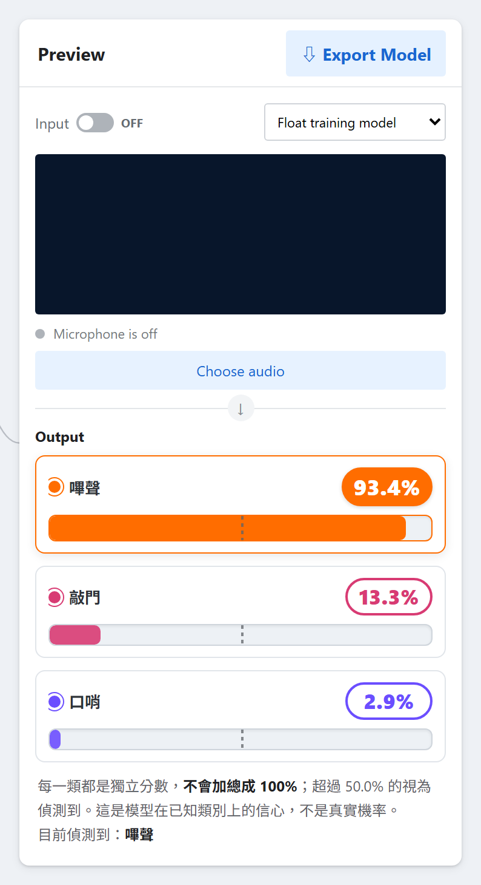

*圖 2：Known Sound 的 Preview（示範資料為合成音訊）。三條分數是 93.4%、13.3%、2.9%，加起來 109.6%——這不是計算錯誤，而是每一類各自獨立判斷的結果。長條上那條虛線刻度是門檻，超過才算偵測到；這張圖三類都用共用的 50.0%，如果你在設定裡給了每類各自的門檻，刻度線就會落在不同位置（見 5.5）。*

---

## 4. 日常流程

四種專案的操作步驟是一樣的：**建立專案 → 增加類別 → 收集樣本 → 訓練模型 → Preview 測試 → 匯出模型**。有兩條規則貫穿整個流程，務必先理解：

> **規則一：任何時候你去動樣本或設定，等於立刻把已經訓練好的模型丟掉。**
> **規則二：按下「訓練」的那一刻，不管新的訓練最後成不成功，舊模型、舊的 TensorFlow Lite 檔案、已經建好的韌體都會先被清空。**

這兩條規則合起來的意思是：**從你動手改任何東西的那一刻起，就要當作模型已經不見了**，一直到下一次訓練成功為止。沒有確認對話框、沒有「復原」按鈕。

### 4.1 建立專案、增加類別

在首頁點四張卡片其中一張，專案立刻建立，帶著這個種類預設的類別名稱（例如 Image 是「Class 1」「Class 2」；Audio 是「Background Noise」「Class 2」；Known Sound 是「Class 1」「Class 2」「Background」）。專案名稱、類別名稱都可以隨時改，**改名字不會影響已訓練好的模型**。

但是：**新增或刪除一個類別、清空某個類別的樣本，都會立刻讓已訓練的模型消失**（規則一）。每個專案最多 20 個類別，Image / Audio / Known Sound 至少要留 2 個類別（刪到剩 1 個會被擋下來）；Abnormal Sound 的「Normal」容器是鎖住的，不能改名也不能刪除，但額外的「異常範例」群組可以刪到一個都不剩。

### 4.2 收集樣本

**Image：** 開啟類別卡片，按住 Webcam 的錄製按鈕不放，系統會持續每 260 毫秒（大約每秒 3.8 張）自動拍照，放開才停止；也可以用「上傳」一次匯入多張圖片。卡片上只會顯示最近 240 張縮圖，但實際訓練會用到**全部**樣本，數量請以「N Image Samples」的文字為準，不要用縮圖數量去猜。


*圖 3：Image 專案頁（示範資料為合成影像）。畫面分成三欄：左邊每一張卡片是一個類別，卡片上的「Webcam」與「Upload」就是收樣本的兩個入口，縮圖只顯示最近 240 張，真正的樣本數要看「N Image Samples」那一行；中間是訓練卡片（第 4.4 節按的就是這裡，圖中模型已經訓練完成，所以按鈕變成「Retrain Model」）；右邊是 Preview 與 Export Model（第 4.5、4.6 節）。*

**Audio（含 Known Sound、Abnormal Sound）：** 這裡有一個容易誤解的關鍵概念——**「一次錄音場次」跟「一段音檔切出來的片段數」是兩回事**。按一次「Record 20 Seconds」（會在 20 秒時自動停止），系統會把這 20 秒切成 20 個 1 秒片段，但這整段錄音**只算 1 次獨立場次**，不是 20 筆獨立的例子。Known Sound 和 Abnormal Sound 都會分別檢查「場次數」和「片段數」，而且驗證時會刻意讓同一次錄音切出來的片段全部待在同一邊（要嘛全部用來訓練，要嘛全部用來驗證），這樣算出來的準確率才不會虛高。換句話說：**同一種聲音，請分開錄很多次**（不同時間、不同距離、不同音量、不同位置），而不是錄一次很長的音檔。上傳的音檔也一樣，一個檔案算一次場次，超過 120 秒的檔案只會取用前 120 秒，多出來的部分會被靜靜捨棄，不會有任何提示。

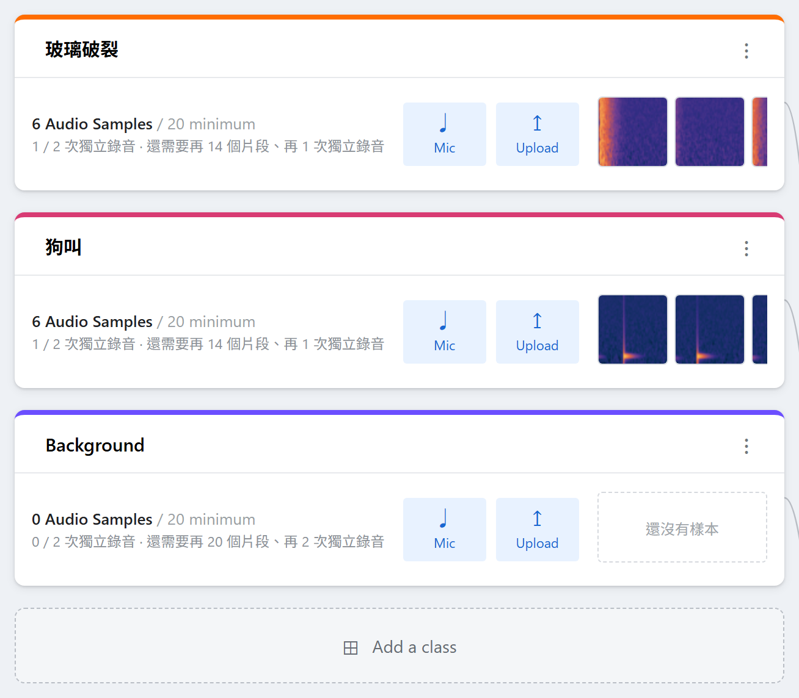

*圖 4：前兩個類別各只錄過一次、Background 還完全沒錄的 Known Sound 專案。卡片上那行「6 Audio Samples / 20 minimum」與下面那行「1 / 2 次獨立錄音」是兩個各自獨立的門檻，後面接著寫出還差多少——這就是上一段要你「分開錄很多次」的原因：錄一次很長的音檔只會讓上面那行的片段數變大，下面那行還是停在 1。*

**用開發板本身的麥克風或鏡頭收樣本（選用）：** 如果模型最後要燒到板子上，用「同一顆」麥克風或鏡頭收集樣本，可以避免模型學到的是筆電麥克風或 Webcam 的音色與畫質，而不是板子上實際收到的樣子。`1_Collect_Firmware_bin` 資料夾裡的韌體就是做這件事的：燒進板子之後，板子接上電腦會變成一支 USB 麥克風或一台 USB 攝影機，在 Studio 收樣本時從麥克風／攝影機選單選它即可。

| 板子資料夾 | 檔案 | 板子會變成 | zip 裡可燒錄的 `.bin` |
|---|---|---|---|
| `NuMaker-X-M55M1D` | `DMIC_UAC_Codec_Monitor.zip` | USB 麥克風（電腦上顯示為 `M55M1 DMIC Mic`），另可插耳機即時監聽 | `Keil\release\DMIC_UAC_Codec_Monitor.bin` |
| `NuMaker-X-M55M1D` | `HSUSBD_Video_CAM.zip` | USB 攝影機（HM1055 感測器） | **沒有**，只有原始碼，需要自行用 Keil 編譯 |
| `NuMaker-GestureAI-M55M1` | `DMIC_UAC_NuMaker-GestureAI-M55M1.zip` | USB 麥克風 | `Keil\release\DMIC_UAC_Codec_Monitor.bin` |
| `NuMaker-GestureAI-M55M1` | `HSUSBD_Video_CAM_GC0308.zip` | USB 攝影機（GC0308 感測器） | `KEIL\Objects\HSUSBD_Video_CAM.bin` |
| `NuMaker-VoiceAI-M55M1(Chip select M5531)` | `DMIC_UAC_NuMaker-VoiceAI-M55M1.zip` | USB 麥克風 | `VSCode\out\DMIC_UAC_Codec_Monitor\ARMCLANG\Release\DMIC_UAC_Codec_Monitor.bin` |

每個 zip 都是一份完整的專案原始碼，解壓縮後找到上表的 `.bin`，用第 6.4 節對應板子的方式燒錄。要注意一塊板子同一時間只能跑一份韌體：之後把 Studio 建出來的模型韌體燒進去時，這份收樣本用的韌體就會被取代，想再收樣本就要重新燒一次。

### 4.3 樣本數要收多少才夠（這是門檻，不是目標）

按下「訓練」之前，每個種類都有一個最低門檻，沒達到訓練按鈕會維持灰色，卡片上會直接告訴你還缺多少：

| 專案種類 | 最低門檻 |
|---|---|
| Image | 每類至少 5 張 |
| Audio（關鍵字） | 每類至少 8 個片段 |
| Known Sound | 每類至少 20 個片段，**而且**至少 2 次獨立錄音場次 |
| Abnormal Sound | Normal 至少 3 次獨立場次，**而且**總長度至少 60 秒；要讓系統從「只給分數」升級成「有把握地判斷 Normal／Abnormal」，還需要至少 6 次場次、120 秒以上 |

**這些是能夠開始訓練的最低門檻，不是「這樣訓練出來就夠準」的建議值。** 舉例來說，Image 專案在最低門檻（每類 5 張）加上預設的驗證比例下，驗證用的照片其實只有 1 張——這樣算出來的準確率只會落在 0%、50% 或 100% 幾種可能之一，沒有太大意義。實務上可以參考的一個真實例子：Known Sound 曾經用 3 個類別、總共 122 個片段（分散在多次錄音場次）訓練，達到 macro precision 0.969——也就是說，**每類幾十筆、分散在好幾次錄音**是務實可行的教室目標，不需要湊到幾百筆。

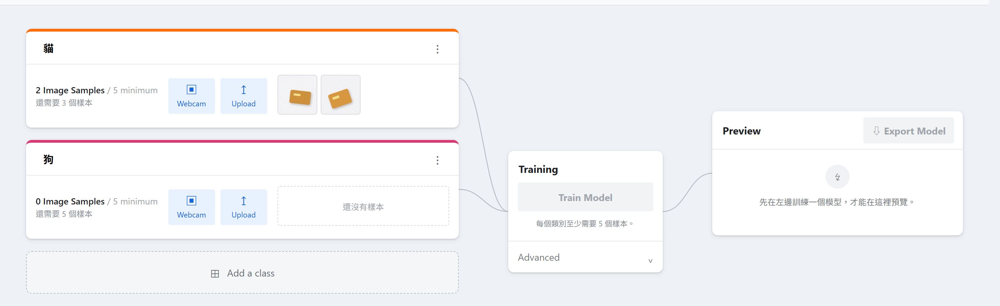

*圖 5：樣本還不夠時的畫面。每張卡片自己會寫出還差幾個樣本，訓練按鈕維持灰色、按不下去，下面那行會說明卡在哪個門檻——你不需要回頭對照上面那張表去算。*

### 4.4 訓練模型

按下「Train Model」會先把你在「進階設定」面板裡的數值送到伺服器存起來，然後開始訓練。**訓練只會產生 `.keras` 這個原生模型格式，不會產生任何 TensorFlow Lite 檔案**——這是刻意的設計：早期版本會在訓練的同時做量化，結果在慢速電腦上訓練進度卡在 71% 不動長達數分鐘，讓人誤以為當機。現在訓練完成後可以立刻用 Preview 測試，量化（也就是 INT8／UINT8 轉換）只在你按下「Export Model」時才會真正發生，而且是在獨立的背景工作裡進行，有自己的進度條和已耗費時間顯示，逾時（預設 20 分鐘）會自動中止，不會弄壞已經訓練好的模型。

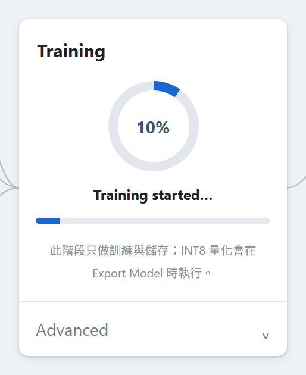

*圖 6：訓練進行中。進度條與訊息會一路跑到 100%，中途停在某個百分比幾十秒是正常的（尤其是第一次要載入預訓練權重時），不是當機。*

訓練中，這個專案的任何編輯（改設定、加樣本、刪樣本、改名）都會被擋下來，訊息是「此專案已有訓練、匯出或部署工作進行中。」——請等它跑完。

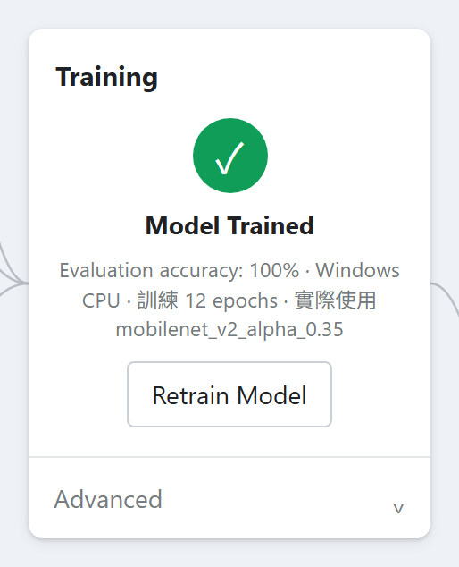

*圖 7：訓練完成。摘要行會列出驗證準確率與實際使用的模型版本——看到「實際使用 small_cnn_fallback」代表當下離線、降級了（見第 2.4 節的「離線陷阱」）。Known Sound 專案是例外，完成後不會顯示任何準確率數字（見第 5.5 節）。*

### 4.5 Preview

模型訓練完成後，Preview 區塊會解鎖。打開 Webcam 或麥克風開關，畫面上會即時顯示分數；也可以用「選擇圖片／音檔」測試單一檔案，不用開鏡頭或麥克風。上面有一個下拉選單可以切換「Float 訓練模型」「INT8 量化模型」「UINT8 量化模型」——後兩個要等你匯出過那個格式才會生效，沒匯出之前一律用 Float 版本預覽。

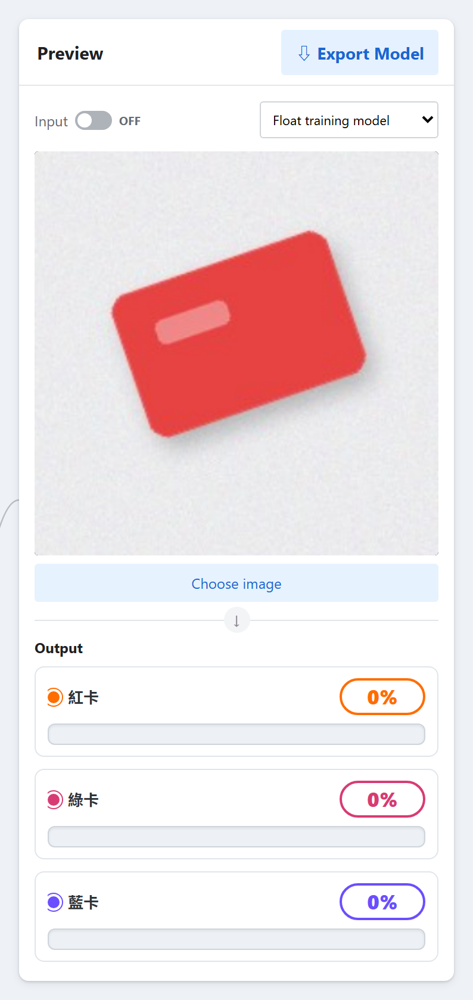

*圖 8：Preview（示範資料為合成影像）。上傳一張圖片後，每個類別各有一條分數長條；上方的下拉選單就是切換 Float／INT8／UINT8 的地方。*

有一件事務必記住：**Audio（關鍵字）專案的「偵測門檻」設定，在 Preview 裡完全不會生效**——Preview 一律顯示模型算出來的原始分數。這個門檻只有匯出後的執行範例程式和燒進板子的韌體會真正套用。如果你把門檻調到 0.9，卻在 Preview 看到 0.4 的分數依然亮起來，那不是 bug，是正常現象。（Known Sound 的每類門檻則不同——它們會實際反映在 Preview 的分數條上，用一條刻度線標出每一類自己的門檻位置。）

### 4.6 匯出模型

「Export Model」視窗有兩個頁籤：TensorFlow Lite（下載模型檔）和「部署到開發板」（見第 6 節）。TensorFlow Lite 頁籤可以勾選五種格式：Quantized INT8（預設勾選，建議使用）、Quantized UINT8、Float32、Dynamic Range、Keras model；還有一個「同時產生 model_data.h C array」的選項。

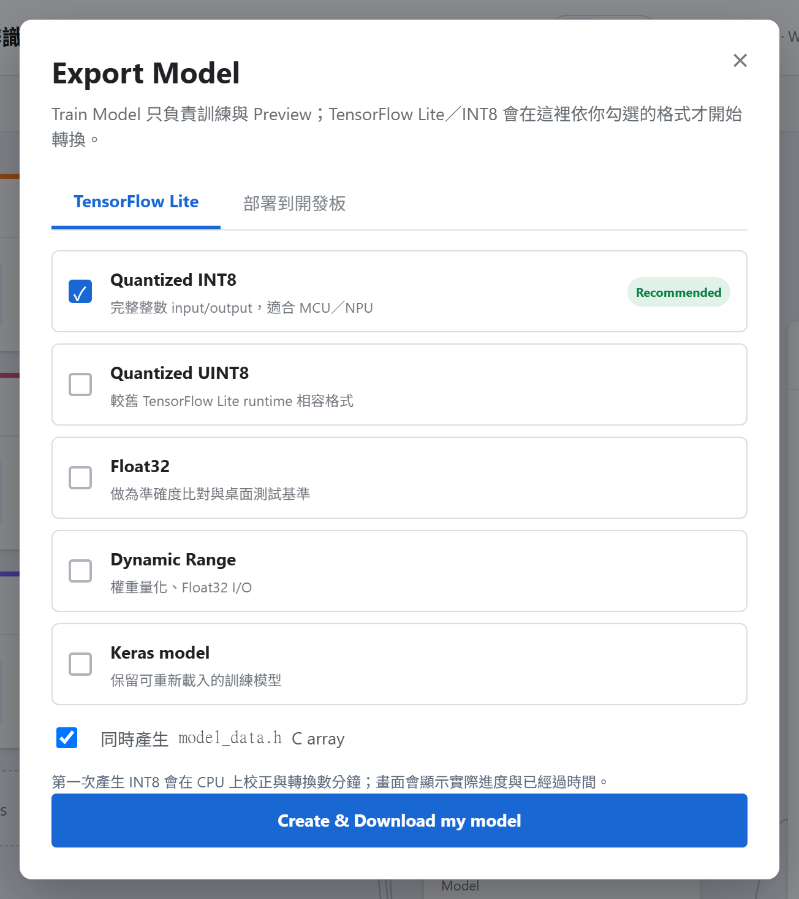

*圖 9：匯出模型對話框的 TensorFlow Lite 頁籤。五種格式裡預設只勾 Quantized INT8，最下面的「同時產生 model_data.h C array」也預設是勾的。上方另一個頁籤「部署到開發板」見第 6 節。*

INT8／UINT8 的轉換是**嚴格的**：轉換完成後系統會檢查輸入輸出是不是真的都是整數、有沒有殘留任何浮點數張量、有沒有用到不支援的運算子。只要有一項不符合，匯出**會直接失敗**並告訴你原因，而不會偷偷把一個混合精度的模型當作 INT8 交給你。如果 INT8 模型跟原本的 Float 模型判斷結果一致的比例低於 95%（僅適用於 Image 和 Audio 兩種分類器），畫面上會出現黃色提醒，但匯出仍會成功——這代表量化讓準確率掉了不少，值得回頭檢查資料量或訓練設定。

只勾選「Keras model」的話，ZIP 裡只會有 `.keras` 檔本身加上標籤與設定檔，不會有可執行的範例程式；只要勾了任何一種 TensorFlow Lite 格式，ZIP 才會附上一份可以直接執行的 `run_model.py` 範例。

---

## 5. 參數的意義

這是整份手冊最重要的一節。打開類別卡片下方訓練區塊裡的「Advanced（進階設定）」，會看到依專案種類而不同的一組控制項。在細看每一個參數之前，有三件事必須先建立起來：

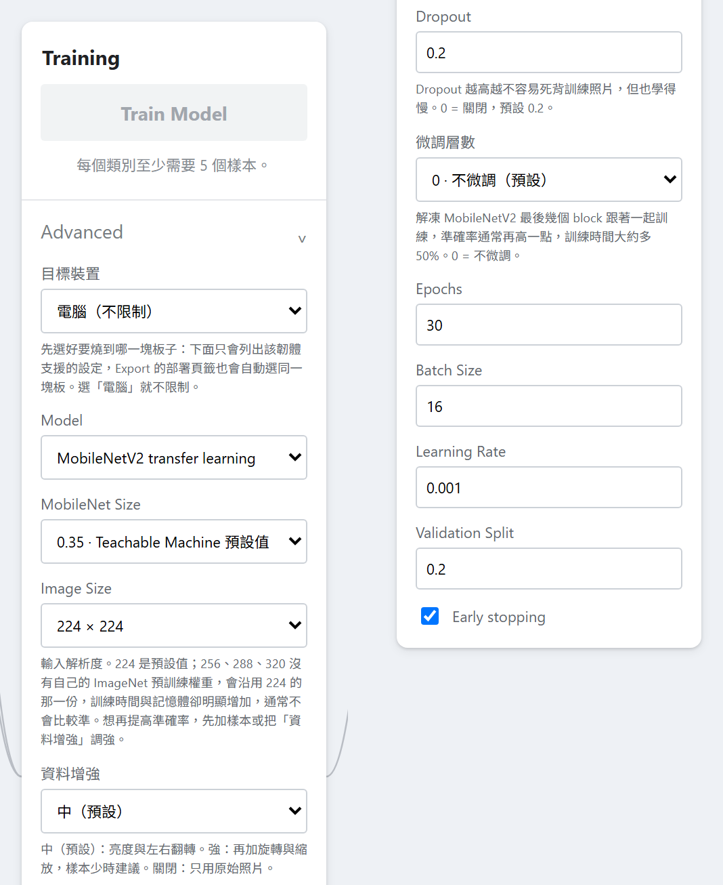

*圖 10：展開「Advanced（進階設定）」之後的面板，這裡是 Image 專案、目標裝置維持預設的「電腦」，所以所有選項都還沒有被限制。其他種類的專案控制項不同，見 5.4～5.6；選了開發板之後會變成什麼樣子，見 5.7。*

**這個面板裡的數字，在你按下「Train Model」之前都只是草稿，存在瀏覽器裡，不會生效。** 只有按下訓練，這些值才會真正送到伺服器存檔並開始訓練。這代表：你可以打開面板隨便看看數值，只要不按訓練就不會有任何影響；但也代表——如果你不小心手滑改了一個數字，而且之後按了訓練，舊模型會立刻被清空，不管新的訓練最後成不成功。

**真正的把關者是伺服器，不是畫面上的滑桿或數字框，而且它一律用英文的設定鍵名稱回答你。** 畫面上的輸入框大多有 `最小值/最大值` 的限制，但那只是提示，真正擋住不合理數值的是伺服器端的檢查。送出不合法的值會看到紅色提示，例如「`epochs` 必須介於 1 與 300 之間，收到 500」——注意訊息裡用的是英文的設定鍵（`epochs`），不是畫面上的中文標籤（Epochs）。下面每個參數都會同時列出中文標籤與英文鍵名，方便你對照錯誤訊息。

**選了開發板之後，有些參數會被鎖住。** 這是因為韌體是針對固定的輸入格式編譯出來的，事後改變輸入格式，韌體就讀不懂新模型了。哪些參數會被鎖、鎖成什麼值，本節最後會用一張表整理。

### 5.1 目標裝置（deployment_target）——所有可部署的專案都有

這個選項決定這個專案未來要燒到哪一塊板子，**它是訓練設定，不是匯出時才選的選項**。選了板子之後，其他參數會被限制在該板子支援的範圍內。Abnormal Sound 完全沒有這個選項，因為它沒有對應的韌體。

預設是「電腦」，其他選項只有支援這個專案種類的板子才會出現在下拉選單裡（例如沒有相機的 VoiceAI 板，Image 專案的選單裡根本看不到它）。建議**先決定要不要燒板子，再開始收集樣本、設定訓練參數**——事後才選板子，常常會發現之前訓練用的設定（例如圖片尺寸）跟板子不相容，得重新訓練。

### 5.2 Image 與 Audio 共用的五個基本設定

| 中文標籤（設定鍵） | 預設值 | 允許範圍 | 什麼時候調 | 調錯／用錯時會看到什麼 |
|---|---|---|---|---|
| Epochs（`epochs`） | Image 30／Audio 40 | 1–300（整數） | 「提早停止」預設是開著的，會依 epoch 數自動算出耐心值（大約是 epoch 數的四分之一，介於 3～10 次之間），所以調高 epoch 不代表會多練很久；真的想練久一點，先看訓練報告裡 `epochs_completed` 是不是等於你設定的 `epochs`（代表沒有提早停止、還在進步），再考慮調到 60～80。教室示範想快一點可以調到 10～15 | 超出範圍：「`epochs` 必須介於 1 與 300 之間，收到 500」；打小數：「`epochs` 必須是整數，收到 12.5」 |
| Batch Size（`batch_size`） | 16 | 1–128（整數） | 教室等級的資料量（幾十到幾百筆）用預設值就好，幾乎不用調。調小只在圖片解析度拉到 224 以上、訓練報記憶體錯誤時才需要 | 超出範圍會被拒絕；設得比整個訓練集還大是合法的，但每個 epoch 只會跑一個批次，模型幾乎學不到東西，準確率會卡在「1 ÷ 類別數」附近，沒有任何錯誤訊息提示你原因 |
| Learning Rate（`learning_rate`） | 0.001 | 0.000001–0.1 | 建議不要調。驗證損失如果劇烈震盪，可以試試 0.0005 或 0.0001；調到 0.003 以上，配合凍結的 MobileNetV2 通常會讓準確率變差。**輸入框的上下箭頭一次只會微調一點點且不是從預設值起跳**，建議直接輸入數字，不要用箭頭 | 設成 0 或負數：「`learning_rate` 必須介於 1e-06 與 0.1 之間，收到 0.0」；設太高：訓練會跑完，但準確率停在接近亂猜的水準，畫面上不會特別提醒你是學習率的問題 |
| Validation Split（`validation_split`） | 0.20 | 0.0–0.45 | 資料多、想更確信準確率數字時可以調到 0.3。**千萬別設成 0**：這樣做在技術上是合法的，但「Evaluation accuracy」會變成拿訓練時看過的照片來自我評分，通常會虛高到接近 100%，卻沒有任何意義 | 超出範圍會被拒絕。在 Image 的最低樣本數（每類 5 張）下，0.20 的切分只會留下每類 1 張圖做驗證，準確率因此只可能是 0%、50% 或 100% 之一 |
| Early stopping（`early_stopping`，勾選框） | 開啟 | 開／關 | 保持開啟。只有在想單純展示「完整訓練曲線長什麼樣子」時才關掉，關掉之後模型會停在最後一個 epoch，而不是驗證表現最好的那個 epoch，通常反而更差 | 傳入非布林值會被拒絕：「`early_stopping` 必須是 true 或 false」 |

### 5.3 Image 專案專屬設定

| 中文標籤（設定鍵） | 預設值 | 允許範圍 | 什麼時候調 | 調錯／用錯時會看到什麼 |
|---|---|---|---|---|
| Model／backbone（`backbone`） | MobileNetV2 transfer learning | `mobilenet_v2` 或 `small_cnn` | 幾乎不要主動選 Small CNN——它是完全從零訓練的小網路，在教室等級的資料量下明顯輸給有預訓練知識的 MobileNetV2，只是離線環境失敗時的備援 | 選了 Small CNN，「微調層數」控制項會整個變灰。**如果 MobileNetV2 的預訓練權重下載失敗**（通常是離線），訓練不會報錯，而是自動改用 Small CNN，完成後的摘要行會多出「實際使用 small_cnn_fallback」——看到這幾個字才代表真的降級了；如果看到的是「實際使用 mobilenet_v2_alpha_0.35」這種字樣，那是正常現象（每次成功用 MobileNetV2 訓練，都會標出實際用的版本），不是警訊 |
| MobileNet Size（`mobilenet_alpha`） | 0.35 | 只能是 0.35／0.5／0.75／1.0 其中之一 | 0.35 是這個工具原本的預設值，多數情況下就是最好的選擇。只有在只跑電腦、類別彼此外觀很相似、照片又夠多時，才考慮調到 0.5 或 0.75。**打算燒板子的話，超過 0.35 幾乎必定會在部署時因為記憶體不足被拒絕** | 傳入不在清單內的值（例如 0.6）：「`mobilenet_alpha` 只能是 0.35、0.5、0.75 或 1.0」；**離線陷阱**：安裝時只預先下載了 alpha=1.0（224）這個尺寸的權重，但預設專案用的是 alpha=0.35，所以就算裝好了，第一次用預設設定訓練時仍然需要連網下載另一份權重檔，離線的話會靜靜地退回 Small CNN（見上一列）。板子上放不下時，會在「建置韌體」階段看到「tensor arena 超過板子預算」，建議先調低這個值或 Image Size |
| Image Size（`image_size`） | 224 | 電腦：96–320 之間、32 的倍數（96/128/.../320）；**選了板子之後只能是 96／128／160／192／224** | 要辨認的東西在畫面裡很小（例如手勢）時調高；板子記憶體不夠或訓練太慢時調低。**256／288／320 沒有自己的預訓練權重，會借用 224 那份**，訓練時間與記憶體明顯增加，通常不會比較準——想再提高準確率，優先加樣本或把「資料增強」調強，而不是拉高解析度 | 不是 32 的倍數：「`image_size` 必須是 32 的倍數（96、128、...、320），收到 200」；選了板子卻用 320：「部署到開發板時 `image_size` 只能是 (96, 128, 160, 192, 224)，收到 320」；把「目標裝置」從電腦切到板子時，畫面會自動把不合法的尺寸改回 224 並提示你 |
| 微調層數（`fine_tune_blocks`） | 0（不微調） | 0–4（整數） | 預設訓練結果卡在 80–90% 附近、手上已經有每類 50 張以上照片時可以試試 1～2 層——這是唯一讓 MobileNetV2 本身也跟著你的照片調整的方式，代價是訓練時間大約多五成。樣本很少時反而容易造成訓練準確率衝高、驗證準確率下滑（過擬合） | 超出範圍：「`fine_tune_blocks` 必須介於 0 與 4 之間，收到 7」；選了 Small CNN 時這個控制項會整個鎖住並強制歸零，因為 Small CNN 沒有預訓練權重可以微調 |
| 資料增強（`augmentation_level`） | medium | off／light／medium／strong | 樣本少、或每張照片都是同一個場景光線下拍的，先把這裡調到「強」，再考慮拉高 Image Size。只有在需要保留左右方向意義的場合（例如要分辨「左手」跟「右手」）才不要用會左右翻轉的等級（除了「關閉」以外每一級都會翻轉），否則等於在教模型錯的答案 | 傳入未知等級：「`augmentation_level` 必須是 off／light／medium／strong 之一，收到 …」 |
| Dropout（`dropout`） | 0.2 | 0.0–0.6 | 訓練準確率遠高於驗證準確率（代表在死記硬背）時調高到 0.3–0.4；如果連訓練準確率都拉不上去，調低到 0–0.1 | 超出範圍會被拒絕；設到 0.6 又資料很少時，準確率可能完全拉不起來，畫面不會提示原因是 Dropout 太高 |

### 5.4 Audio（關鍵字辨識）專屬設定

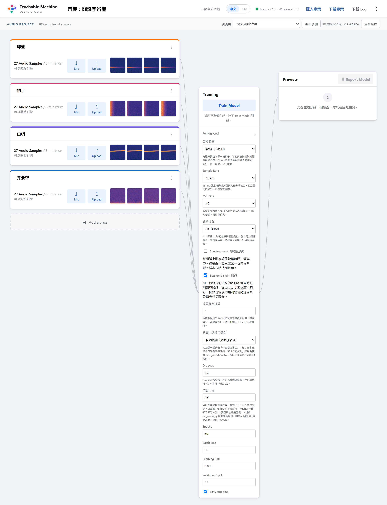

*圖 11：Audio（關鍵字辨識）專案頁與它的設定。取樣率、Mel Bins、SpecAugment 只有這一種專案才有，背景類別與偵測門檻則是跟 Known Sound 共用的；收集樣本時要先按卡片上的「Mic」才會出現「Record 20 Seconds」，「一次錄音場次」的概念見第 4.2 節。*

| 中文標籤（設定鍵） | 預設值 | 允許範圍 | 什麼時候調 | 調錯／用錯時會看到什麼 |
|---|---|---|---|---|
| Sample Rate（`sample_rate`） | 16000 Hz | 電腦上可選 16 kHz 或 44.1 kHz；**選了板子之後只能是 16 kHz**，選單會直接鎖住 | 不建議改。44.1 kHz 只適合完全不打算燒板、需要更高頻內容的情境，而且**切到 44.1 kHz 會連帶把 FFT 長度、最高頻率也一起換掉，等於整套頻譜規格改變**，模型必須整個重練 | 板子模式下傳入 44100：「部署到開發板時 `sample_rate` 必須是 16000，收到 44100」；把「目標裝置」切到板子時，畫面會自動改回 16 kHz 並提醒你頻譜規格變了、模型要重練 |
| Mel Bins（`mel_bins`） | 40 | 只能是 40 或 64（不論有沒有選板子） | 64 能分辨音色比較細緻的差異，模型會略大一點；40 最省空間也是預設。這個限制不因板子與否而放寬，因為訓練用的 CNN、匯出的濾波器表、韌體的 C 常數表只在這兩個寬度下才對得起來 | 傳入 80：「`mel_bins` 只能是 (40, 64) 之一，收到 80」 |
| 資料增強（`augmentation_level`） | medium | off／light／medium／strong | 所有錄音都在同一個安靜房間、同一支麥克風錄的時候，調到「強」（會額外加入雜訊）；需要保留片段內精確時間點時用「關閉」 | 傳入未知等級會被拒絕，從匯入檔案讀到未知值時會自動降級為 medium |
| SpecAugment（頻譜遮罩，`spec_augment`） | 關閉 | 開／關 | 每類樣本數偏少時打開——遮罩範圍刻意設得很小（最多遮住每軸十分之一），風險低 | 傳入非布林值會被拒絕 |
| Session-disjoint 驗證（`session_disjoint_validation`） | **開啟** | 開／關 | 建議保持開啟。這是確保「驗證用的片段跟訓練用的片段不是同一次錄音切出來的鄰居」的機制，關掉會讓準確率看起來比較漂亮，但沒有意義。只有某一類全部樣本都來自同一次錄音場次時，該類會自動退回逐片段切分，並在訓練完成後的提示裡點名是哪一類、告訴你「這幾類的 accuracy 可能偏高，換個時間、位置再錄一次會更準」 | 無 |
| 背景類別（`background_class_id`） | 空白（自動偵測） | 專案內任一類別，或留白讓系統依名稱自動判斷（會抓 background／noise／背景／環境音／安靜等關鍵字） | 建議直接把某個類別命名為「Background Noise」之類，讓系統自動抓到；如果自動抓錯，手動指定 | 指定一個已經被刪除的類別 ID：「`background_class_id` … 不是這個專案的類別」 |
| 背景類別權重（`background_weight`） | 1.0 | 0.25–4.0 | 裝置常常對著安靜或雜音誤判時調高（減少誤判，但也會讓真正的關鍵字更容易被漏掉）；反過來，如果太遲鈍，調低 | 超出範圍會被拒絕；**專案根本沒有背景類別時設定這個值不會報錯，但完全不會生效**，只會在訓練過程中閃過一行提示，訓練報告裡記著「你要求的權重」跟「實際套用的權重（1.0）」不一樣 |
| 偵測門檻（`detection_threshold`） | 0.5 | 0.05–0.99 | 裝置常常認錯關鍵字時調高；常常沒反應時調低。**這個設定完全不參與訓練，Preview 也不會套用**（Preview 永遠顯示原始分數），只有匯出後的 `run_model.py` 和燒進板子的韌體才會真正使用它 | 超出範圍會被拒絕；**只有兩個類別的專案有一個隱藏陷阱**：板子上還會額外要求贏家分數比另一個分數高出至少 0.2，而兩個 softmax 分數本來就加總是 1，所以**不管你把門檻調多低，板子上實際生效的門檻永遠不會低於 0.6**——真正的解法是再多收一個類別（例如背景音），不是繼續調這個滑桿 |

### 5.5 Known Sound 專屬設定

Known Sound 用一個固定不變、已經訓練好的 YAMNet 當「耳朵」（這部分永遠不會被重新訓練），你實際訓練的只是接在後面的一個很小的分類層。這也是為什麼下面大部分參數的「調整代價」都很低——真正花時間的是第一次讓 YAMNet 把所有錄音轉換成內部特徵的那個步驟，而不是後面重複訓練分類層的步驟。

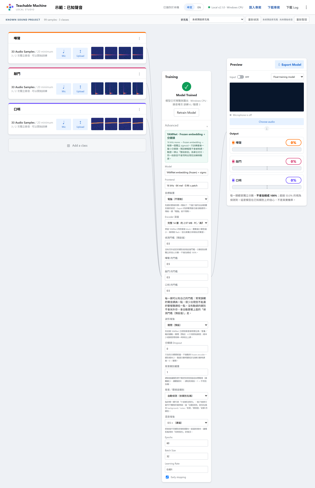

*圖 12：Known Sound 專案頁與它的專屬設定。每一類都有自己的門檻欄位（欄位留白會被當成 0，而 0 不合法），Encoder 深度只有為了塞進板子才需要調低。這裡的分數一律稱「信心分數」，各類獨立、不會加總成 100%（見第 3.3 節）。*

| 中文標籤（設定鍵） | 預設值 | 允許範圍 | 什麼時候調 | 調錯／用錯時會看到什麼 |
|---|---|---|---|---|
| Encoder 深度（`encoder_depth`） | 14（完整） | 2–14（畫面只提供 14／12／11／10／9／8／7／6 幾個選項） | **只有為了塞進板子的 flash 空間才需要調低，電腦上沒有理由離開 14。** 層數越少模型越小，但辨認相近聲音的能力也會跟著下降。深度不影響需要的 RAM——每個深度用到的暫存記憶體都一樣（約 151 KB），省的只是 flash 空間 | 見下方深度對照表 |
| 偵測門檻（預設值，`detection_threshold`）／每一類的門檻（`class_thresholds`） | 0.5 | 嚴格界於 0 與 1 之間（不含 0 和 1） | 某一類常常誤判就調高它自己的門檻；某一類雖然少見但絕不能漏掉就調低它自己的門檻。只有你實際動過的那一類會被存成「例外」，其餘類別永遠跟著預設值走 | 填空白或非數字：「進階設定「每類門檻」有一個類別填的不是數字」；填 0 或 1：「必須是 0 與 1 之間（不含）的數字。把欄位清空也算 0」 |
| 波形增強（`waveform_augment_level`） | **off**（注意：跟 Image／Audio 的預設「medium」不同） | off／light／medium／strong | 每類片段數偏少、或都在同一個地方錄的時候調高。這是在 YAMNet 還沒看到音檔之前，先對原始波形做隨機音量／時間偏移／加噪音的複製，讓 YAMNet 看到更多變化版本 | 傳入未知等級會被拒絕 |
| 分類頭 Dropout（`head_dropout`） | 0.0 | 0.0–0.5 | 樣本少、且驗證分數明顯低於訓練分數時才調高。因為真正在訓練的分類層本身很小（只有幾千個參數），過擬合的風險本來就比 Image 低，這通常不是第一個該調的旋鈕 | 超出範圍會被拒絕 |
| 混音增強（`mixup_ratio`） | 0.5（畫面只給 0／0.5／1.0 三個選項） | 伺服器只要求不能是負數 | 保持 0.5——這是刻意合成「兩種聲音同時出現」的訓練資料，讓多標籤能力有實際的訓練依據，而不是純粹指望模型自己推廣。**只有確定實際場景裡聲音絕不會同時出現時才關掉。它會跟波形增強疊加計算：如果波形增強也開著，混合的樣本數是「原始片段數 × 波形增強後的份數 × 混音比例」，也就是每多開一種增強，訓練要跑的樣本會等比增加** | 傳入不在三個選項內的值，畫面會自動改回 0.5 並提示 |
| Epochs／Batch Size／Learning Rate | 120／32／0.001 | **伺服器對這三個幾乎沒有上限**（只要求 epochs、batch size 至少是 1，learning rate 大於 0），比 Image／Audio 寬鬆很多 | 放著不用調——因為真正訓練的分類層很小、用的是預先算好的特徵，就算 120 個 epoch 也是幾秒鐘的事。訓練報告裡有一個具體的量化參考：epoch 數不夠（例如只設 20）時，量化後跟原始模型的誤差會明顯變大 | 傳 0 個 epoch 會被拒絕；傳一個很大的數字（例如打錯成 5000）伺服器不會擋，會真的照著跑（不過提早停止通常會提前結束） |

**Encoder 深度對模型大小的實際影響**（量測值，供決定要不要調低）：

| 深度 | 內部特徵維度 | Vela 編譯後大小（約） | 板子上限 |
|---:|---:|---:|---|
| 14（預設） | 1024 | 約 2.97 MB | 三塊板子都放不下 |
| 13 | 1024 | 約 2.07 MB | 三塊板子都放不下 |
| 12 | 512 | 約 1.56 MB | 只有 X 板放得下 |
| 11 | 512 | 約 1.31 MB | X 板、GestureAI、VoiceAI 都放得下 |
| 10 | 512 | 約 1.05 MB | 放得下 |
| 9 | 512 | 約 0.80 MB | 放得下 |
| 8 | 512 | 約 0.54 MB | 放得下 |
| 7 | 512 | 約 0.28 MB | 放得下 |
| 6 | 256 | 約 0.14 MB | 放得下 |

在唯一一次真正做過的準確率測試（3 類、122 個片段、依錄音場次切分）裡，深度 9～11 幾乎跟深度 14 一樣準，深度 7 以下開始明顯變差；但深度 12 在那次測試裡出現無法解釋的異常（recall 掉到 0.66，重複三次都一樣），**因此深度 12 不建議使用**，即使它剛好是 X 板允許的上限。這張表**只反映那一組資料**，換了深度之後請務必用自己的資料重新看一次驗證報告，不要直接套用這裡的數字。

**Known Sound 有一件事跟其他三種專案不一樣：訓練完成後的畫面上不會顯示任何準確率數字**，只會看到「模型已可預覽與匯出」。每一類的 precision／recall 只存在匯出後的檔案裡（`training_report.json` 或匯出的 ZIP），網頁上目前沒有地方會把它畫出來，需要自己找檔案看。

面板上另外顯示兩行唯讀資訊：模型固定是「YAMNet embedding (frozen) + sigmoid head」，前處理固定是「16 kHz · 64 mel · 0.96 s patch」——這是 YAMNet 官方規格，跟這個專案自己設定裡的取樣率、mel 數（那些其實只用來切片段、畫縮圖）是兩回事，沒有畫面可以更動它。

### 5.6 Abnormal Sound 專屬設定：只有一個旋鈕

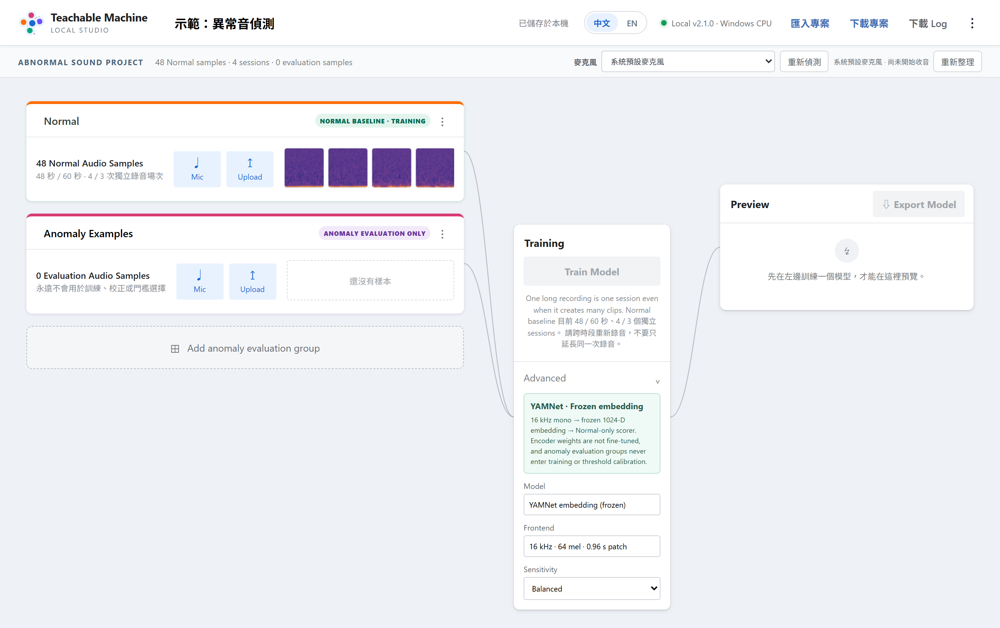

*圖 13：Abnormal Sound 的進階設定——真的就只有「敏感度」一個旋鈕，其他細節（門檻怎麼算、用什麼統計方法）刻意不開放調整。*

Abnormal Sound 的進階設定裡，唯一能調的是「敏感度」：

| 敏感度 | 統計容忍度 | 幾個投票窗口中要幾個同意才報警 | 什麼時候用 |
|---|---|---|---|
| Sensitive（更容易偵測到） | 較寬鬆 | 5 個中有 2 個同意 | 漏掉一次異常的代價比誤報更嚴重時（例如安全監控） |
| Balanced（預設） | 中等 | 5 個中有 3 個同意 | 一般情況 |
| Low false alarm（減少誤報） | 較嚴格 | 5 個中有 3 個同意 | 沒人看著、誤報會很煩人的長時間無人監控場景 |

偵測用的是每 1 秒一個窗口、每 0.5 秒滑動一次，**開機後前 4 個窗口一定顯示「Uncertain」（暖機中），永遠不會在這段時間報警**。其他所有設計細節（門檻怎麼算、用哪種統計方法、用多少維度的特徵）都刻意不開放給教學用的畫面調整。改變敏感度跟改變其他設定一樣，會讓已訓練的模型作廢，需要重新訓練——因為敏感度的參數其實有牽動到內部的門檻校正計算。

### 5.7 選了開發板之後，哪些設定會被鎖住

這是因為韌體是針對固定的輸入格式（圖片尺寸、音訊前處理的每一個數字、模型深度）編譯出來的；如果訓練時的設定跟韌體不一致，模型和韌體就會互相讀不懂對方。系統會在三個時間點分別檢查一次：存設定的時候、（如果你是先用「電腦」訓練完才選板子）建置韌體的時候，以及 Vela 編譯完之後估算大小的時候——每一次擋下來都會直接告訴你該調哪一個設定。

| 專案種類 | 選了板子之後被鎖住的設定 |
|---|---|
| Image | Image Size 只能是 96／128／160／192／224 之一 |
| Audio | 取樣率必須是 16000 Hz；FFT 長度、視窗長度、跳距、最低／最高頻率、dB 下限全部鎖死在固定值（大多沒有對應的畫面控制項——如果你是從匯入的專案或 API 拿到一個跟這些值不同的專案，畫面上根本找不到地方改，只能把「目標裝置」切回電腦，或乾脆開一個新專案重新收音） |
| Known Sound | Encoder 深度：X 板上限 12、GestureAI 與 VoiceAI 上限 11（跟板子無關的獨立限制：Mel Bins 永遠只能是 40 或 64） |
| 全部三種 | VoiceAI 板沒有相機，無法選 Image 專案 |

建議：**如果知道最後要燒板子，先選好板子再開始收樣本、調設定**，可以少走很多回頭路。

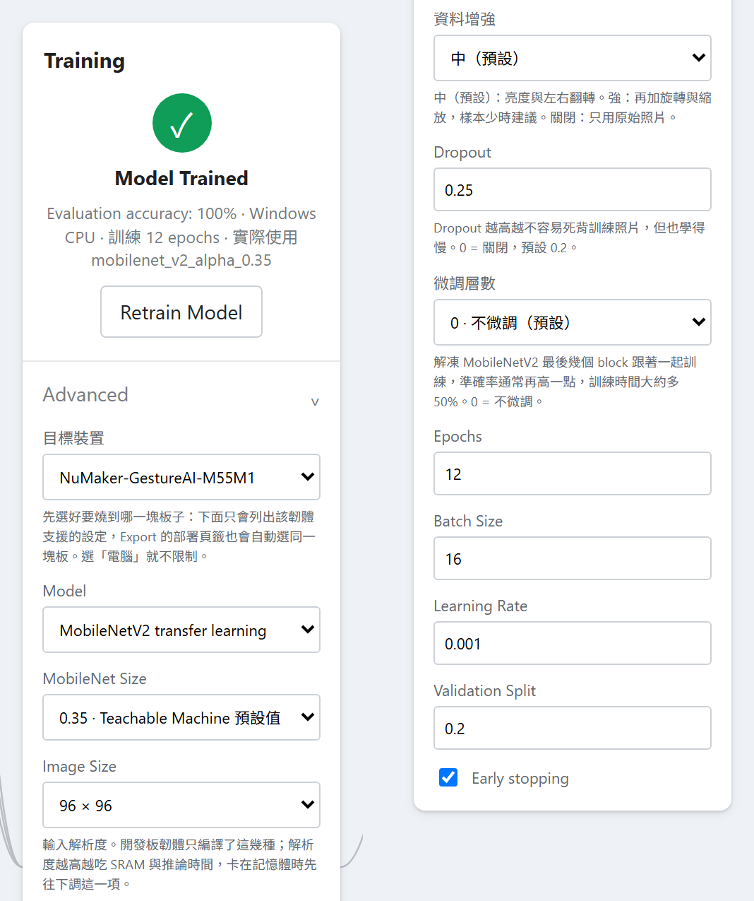

*圖 14：同一個面板，在「目標裝置」選了 NuMaker-GestureAI-M55M1 之後的樣子。跟第 5 章開頭那張（目標裝置＝電腦）並排比較就看得出上表所說的「鎖住」：Image Size 下面的說明從「224 是預設值；256、288、320…」換成了「開發板韌體只編譯了這幾種」。圖中選單沒有展開，展開後也只會列出上表那幾個尺寸。*

---

## 6. 燒錄到開發板

「部署到開發板」是 Export Model 視窗的第二個頁籤，只有 Image、Audio（關鍵字）、Known Sound 三種專案可以用；Abnormal Sound 完全沒有對應的韌體。

### 6.1 三塊板子的差異

| 板子（畫面上的名稱） | 相機 | 顯示畫面的方式 | Known Sound 深度上限 | 燒錄方式 | 能跑的專案 |
|---|---|---|---|---|---|
| NuMaker-M55M1（X 板：LCD、板載 Nu-Link） | 有 | 內建 LCD | 12 | Nu-Link Command Tool（板上內建，或用 Keil 下載） | Image／Audio／Known Sound |
| NuMaker-GestureAI-M55M1（無 LCD：USB 相機 + COM port） | 有 | 沒有 LCD，改用 Windows「相機」app 看 USB 攝影機畫面 | 11 | 預設：拖曳到 USB 隨身碟模式；也可以用 Nu-Link（這條路是使用者回報可行，不是官方文件記載的路徑） | Image／Audio／Known Sound |
| NuMaker-VoiceAI-M55M1（無相機：僅聲音，USB COM port） | 沒有 | 沒有畫面，只有文字（USB 虛擬 COM port） | 11 | pyocd + 外接的 Nu-Link2 除錯器 | 只有 Audio／Known Sound（沒相機不能跑 Image） |

三塊板子的內部 flash（2 MiB）和 SRAM 大小都一樣，差異只在有沒有相機、有沒有 LCD、麥克風接腳配置，以及上面這張表列出的燒錄方式。

### 6.2 要先安裝什麼

**唯一需要學生自己額外安裝的是 Arm GNU 編譯工具鏈**（`arm-none-eabi-gcc`）。韌體樣板、開發板 BSP、Vela NPU 編譯器都已經內附在 Studio 資料夾裡，不用另外下載。因為授權條款的關係，這個工具鏈不能內附，需要自己裝一次：

```bat
.venv\Scripts\python.exe scripts\download_arm_toolchain.py
```

這個指令會下載官方指定版本（14.2.rel1），並且驗證下載檔案的 SHA-256 雜湊值，確認沒有毀損或被竄改，解壓縮到 `runtime\arm-gnu-toolchain\` 後就完成了——不需要重開 Studio，切換到「部署到開發板」頁籤時系統會即時重新偵測。如果你不想用這個腳本，也可以用 Arm 官方安裝程式，或自己解壓縮到同一個位置，只要能找到 `runtime\arm-gnu-toolchain\bin\arm-none-eabi-gcc.exe` 就算數。

**燒錄工具則是另外一回事，而且大多數情況下不裝也沒關係**——建置韌體、下載 ZIP 檔完全不需要它們，只有想用 Studio 裡「燒錄到板子」這個一鍵按鈕才需要：

- **X 板**：需要安裝 Nu-Link Command Tool（Nuvoton 官方工具，Studio 會自動找到常見安裝路徑）。安裝檔已經附在 `2_Compiler and Download Tool Driver\en-us--Nu-Link_Command_Tool_V3.23.7973r.zip`，解壓縮後執行裡面的安裝程式即可。
- **GestureAI**：預設的 USB 隨身碟模式不需要安裝任何東西。
- **VoiceAI**：需要執行一次 `.venv\Scripts\python.exe scripts\setup_voiceai_flash.py`，它會把 pyocd 裝進 Studio 自己的環境裡，並下載一份 Nuvoton 官方的裝置描述檔（同樣會驗證檔案大小與雜湊）。這個板子沒有內建除錯器，一定要另外準備一個外接的 Nu-Link2 除錯器。

就算完全沒裝任何燒錄工具，你仍然可以按「下載韌體 ZIP」拿到 `firmware.bin`，自己用慣用的工具燒錄。

如果你還沒裝 Arm GNU 工具鏈就先打開「部署到開發板」頁籤，「建置韌體」按鈕會直接呈現灰色（停用），旁邊會用中文寫出缺少什麼，例如「還不能部署：缺少 Arm GNU Toolchain（arm-none-eabi-gcc）。」裝好工具鏈之後不需要重開 Studio，切換一次分頁系統就會重新偵測到。

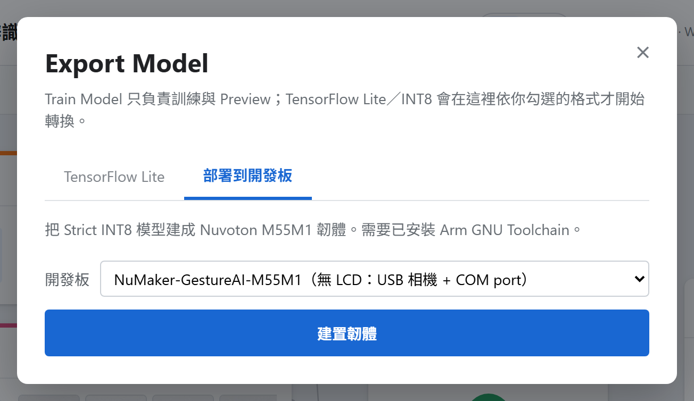

*圖 15：匯出對話框的第二個頁籤「部署到開發板」。上方是板子下拉選單，收合時顯示目前選的板子（這裡是 NuMaker-GestureAI-M55M1），展開後只會列出支援這種專案的板子；下面那顆藍色的「建置韌體」代表工具鏈已經偵測到了。工具鏈沒裝好時這顆按鈕會是灰色的，旁邊會用中文寫出缺什麼。*

### 6.3 建置韌體的過程

按下「建置韌體」後，這是一個背景工作，會經過幾個階段（畫面上會顯示進度百分比）：

1. **確認有嚴格 INT8 的匯出檔**——如果你還沒按過 Export，這一步會自動幫你補做。
2. **檢查部署契約**——把標籤、量化參數、前處理規格、每類門檻等資訊，跟選定板子的限制再核對一次（因為你可能是先用「電腦」訓練完才選板子）。
3. **用 Vela 幫 NPU 編譯模型**，並回報模型需要的 flash 和暫存記憶體大小；如果第一次嘗試（追求速度）超出預算，會自動再試一次追求體積的設定。
4. **提前檢查 flash 夠不夠放**——這一步會在真正編譯韌體之前，就用 Vela 算出來的大小去判斷放不放得下，如果放不下會直接告訴你該調哪個設定（通常是圖片尺寸、MobileNet 尺寸，或 Known Sound 的 Encoder 深度），而不是讓你多等兩分鐘卻在編譯到一半才報錯。
5. **組出完整的韌體專案、呼叫 `arm-none-eabi-gcc` 編譯連結、打包成 ZIP**。

**大概要花多久：** 專案裡沒有留下任何一次完整建置的精確計時紀錄，只有逾時上限（整個部署工作預設 20 分鐘，Vela 編譯階段最多 10 分鐘）。可以確定的是：GCC 這個編譯連結的階段是最花時間的一段，大約是幾分鐘的等級；你自己這台電腦實際花了幾秒鐘，會被記錄在建置完成後的 `deploy_report.json` 裡。不要期待一個固定不變的秒數。

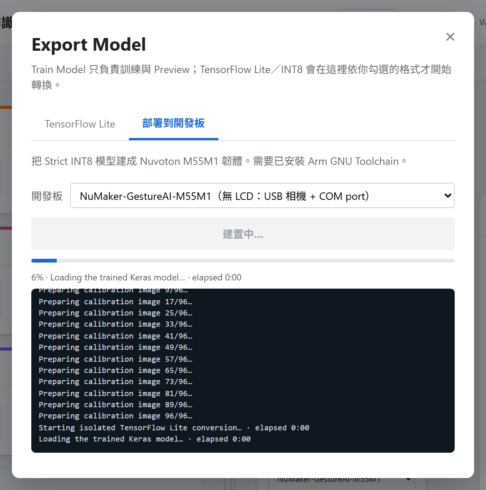

*圖 16：建置韌體進行中。進度條下方的 log 會逐行顯示目前走到上面五個階段的哪一步；停在 GCC 編譯那一段數分鐘是正常的。*

建置完成後，所有檔案會放在專案資料夾底下的 `models\mcu\<板子名稱>\`，包含 `firmware.bin`、原始碼快照、燒錄說明、建置紀錄，以及可以整包下載的 ZIP。**重新訓練或改動任何樣本／設定，會連同這個資料夾一起清空**——已經建好的韌體會消失，畫面上只會提示「模型已變更，請重新建置。」


*圖 17：建置完成。log 停在「部署產物已完成」，下面那條摘要列出這份韌體佔掉多少 flash 與暫存記憶體（這裡是 Flash 653.9 KB / 2.00 MB、SRAM01 206.0 KB / 1.00 MB）；再下面是燒錄方式與步驟，最底下左邊的「下載韌體 ZIP」就算你沒裝任何燒錄工具也能按，拿到 `firmware.bin` 自己燒。*

### 6.4 選擇燒錄方式

只有 GestureAI 板同時支援兩種燒錄方式，其他兩塊板子各自只有一種：

- **GestureAI —— USB 隨身碟模式（預設，不需要另外裝軟體）：** 按住板子上的 User 鍵，同時按一下 Reset，再放開 User 鍵；電腦上會出現一個名稱是 `M55M1` 的隨身碟，把 `firmware.bin` 拖進去（或直接按 Studio 裡的「燒錄到板子」，它會自動找到這個隨身碟並複製過去），完成後按一下板子的 Reset 鍵。
- **GestureAI —— Nu-Link（備用方式）：** 跟 X 板相同做法。
- **X 板 —— Nu-Link Command Tool：** 需要先另外裝好 Nuvoton 官方工具，Studio 會依序執行連接、寫入、重置三個步驟，任何一步失敗都會停下並回報。也可以直接用 Keil 的下載功能燒同一個 `.bin` 檔。
- **VoiceAI —— pyocd + 外接 Nu-Link2：** 這塊板子沒有內建除錯器，必須另外接一個 Nu-Link2 到板子的 J2 排針。燒錄完成後**不會自動重置板子**（這是刻意的，因為自動重置指令在這個除錯器上反而會讓板子看起來像當機），畫面會提醒你手動按一下 Reset。

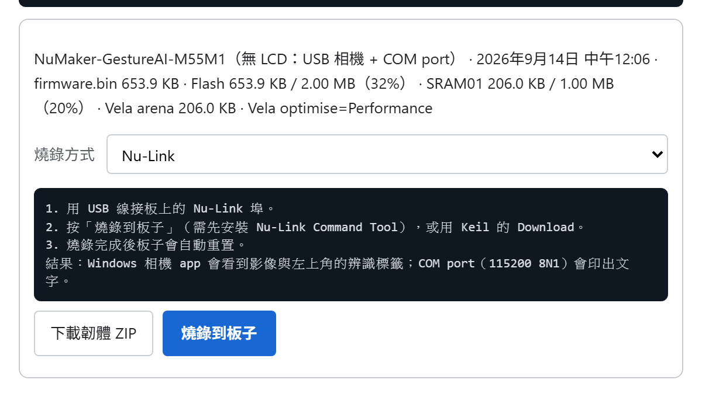

*圖 18：同一塊 GestureAI 板，把「燒錄方式」從隨身碟改成 Nu-Link 之後，下面的步驟就整段換成 Nu-Link 的版本——跟圖 17 那張（USB 隨身碟 bootloader，四個步驟）比對就看得出來。只有 GestureAI 這塊板子有兩個選項，另外兩塊板子這個選單只會有一項。*

按下「燒錄到板子」之前，Studio 會先跳出確認對話框告訴你檔案大小與目標板子，並且在真正動作前重新核對一次檔案的雜湊值，確保不是損毀或被改過的檔案。

### 6.5 燒錄成功之後，會看到什麼

**這件事跟種類有關，跟板子無關：** 只有 Image 專案會產生畫面，Audio 和 Known Sound 一律只有文字輸出。

- **Image：** 在有 LCD 的 X 板上，辨識結果（類別名稱與分數，例如「開燈:0.9876」）會直接顯示在 LCD 上，並多顯示一行畫面更新頻率。GestureAI 沒有 LCD，改成把同樣的文字疊在 USB 攝影機畫面的左上角——打開 Windows 內建的「相機」app 就能看到疊字（只有電腦真的在讀取這支攝影機時才會畫上去）。兩種板子都會同時把同一行文字送到序列埠。
- **Audio（關鍵字）與 Known Sound：** 兩種板子都不會開啟相機，只會透過序列埠印出文字——就算是有相機的 GestureAI 板，跑的是聲音專案時同樣不會看到任何畫面，這是正常現象，不用去開相機 app 找。

**打開序列埠主控台：** 在 Windows「裝置管理員 → 連接埠 (COM 和 LPT)」裡找到新出現的那個 COM port，用 PuTTY 或 Tera Term 之類的終端機軟體連線，設定為 **115200 baud、8 資料位元、無同位檢查、1 停止位元（115200 8N1）**。**沒有 LCD 的板子（GestureAI、VoiceAI）開機後最多只會等待終端機 10 秒**，所以請先把終端機軟體打開、連好線，再按板子的 Reset 鍵，不然開機時印出的第一批訊息（型號、量化參數等等）會來不及看到，只剩下後面持續刷新的那幾行。

**讀懂 Known Sound 的輸出：** 每 0.5 秒（預設）印一行，格式類似：

```text
live rms  -42.1 dBFS | front   14 ms | npu    9 ms | ovr 0 | drop 0 | 槍聲=0.031  狗叫聲=0.008  玻璃破裂=0.742*
```

- `rms`：這 1 秒音量大小（分貝），安靜房間大約在 -90 附近。
- `front` / `npu`：前處理與模型推論各花了幾毫秒。
- `ovr`：麥克風資料遺失的累計次數，應該一直是 0。
- `drop`：文字輸出被截斷的累計位元組數，應該一直是 0（**注意：X 板因為走的是真正的除錯串口而不是 USB 虛擬串口，這個數字在 X 板上永遠是 0，不能拿來判斷別的東西**）。
- 每一類後面的數字是**信心分數**（獨立、不加總成 100%），`*` 代表這一類這一瞬間超過了它自己的門檻。**分數本身其實是過去幾個瞬間裡的最高值（有個短暫的「保留高峰」機制，預設 1.5 秒），但星號只反映「這一瞬間」的原始判斷**——所以你會看到一個數字很高卻沒有星號，這是正常現象，不是 bug。

**讀懂 Audio（關鍵字）的輸出：** 每 0.25 秒（預設）印一行，格式類似：

```text
KWS hop=12 rms=-38.4 dBFS top=開燈 0.876 frontend=28658 us inference=643 us dma_errors=0 drop=0 | 開燈=0.876* 關燈=0.101  background=0.023
```

跟 Known Sound 不同，這裡**永遠只有一個星號**（贏家全拿的機制），而且顯示的分數是最近幾個瞬間的平均值，不是單一瞬間的原始值。真的觸發關鍵字時，會多印一行「KWS DETECTED: label=開燈 score=0.912 hop=57」。

---

## 7. 出問題時

| 症狀 | 可能原因 | 怎麼處理 |
|---|---|---|
| `01_INSTALL.bat` 說找不到相容的 Python | 沒裝 Python 3.13（64 位元、非 free-threaded） | 到 python.org 安裝，勾選加入 PATH |
| `02_START.bat` 跳出英文 traceback | `.venv` 沒裝完整 | 重新執行 `01_INSTALL.bat`，不要刪 `workspace` |
| 提示 Port 8765 已被使用 | 已經開著一份 Local Studio，或另一支程式占用 | 找找有沒有已經開好的分頁；用 `netstat -ano \| findstr :8765` 確認 |
| Image 訓練完摘要顯示「實際使用 small_cnn_fallback」 | 訓練當下離線，MobileNetV2 權重下載失敗 | 連上網路，重新訓練 |
| Known Sound／Abnormal Sound 訓練直接被擋，說 YAMNet 權重沒裝好 | 安裝時網路不通，YAMNet 權重沒下載成功 | 連上網路重跑一次 `01_INSTALL.bat` |
| 改了 Validation Split 卻改不成 0 | 畫面重繪時的已知小狀況，把 0 當成空值重新變回 0.2 | 就讓它維持 0.2 或更高，不要試圖硬把它設成 0——設成 0 的準確率本來就沒有意義 |
| Audio 專案調高「偵測門檻」，Preview 卻沒有任何變化 | 這個設定本來就不影響 Preview，只影響匯出後的程式與韌體 | 調完之後直接匯出、燒板測試，不要用 Preview 檢查這個設定 |
| 兩類別的 Audio 專案，門檻怎麼調都好像卡在 0.6 附近 | 板子上還有一個隱藏的「贏家要贏過對手 0.2 分」規則，兩個 softmax 分數只會加總是 1 | 再新增一個類別（例如背景音），問題就會解除 |
| Known Sound 每類門檻填了東西卻被拒絕 | 欄位空白會被當成 0，而 0 或 1 都不合法（必須嚴格界於兩者之間） | 要用預設值就把欄位清空後改填回目前的預設值數字，不要留白 |
| 建置韌體時說「tensor arena 超過板子預算」或「超過內部 flash」 | 模型太大（Image：尺寸或 MobileNet 版本太大；Known Sound：Encoder 深度太深；Audio：韌體本身就快滿了，調設定通常沒用） | 依訊息指示調低對應設定，重新訓練並匯出 |
| 建置韌體一開始就被拒絕，說資料夾路徑太長 | Studio 資料夾放在很深的路徑下 | 把整個資料夾搬到短路徑（例如 `C:\TM_Studio`），不需要重新安裝 |
| 「燒錄到板子」按下去說找不到隨身碟／工具 | 對應的燒錄工具沒裝，或板子沒有進入正確模式 | 400 錯誤訊息本身就是完整的手動燒錄步驟，照著做，或先完成第 6.2 節的一次性安裝 |
| 燒錄或建置時偶爾出現「檔案被占用／PermissionError」 | 防毒軟體暫時鎖住剛寫好的檔案 | Studio 本身有重試機制，通常會自動恢復；如果持續失敗，把整個 `workspace` 資料夾加入防毒軟體的排除清單 |
| 任何操作都想留一份證據回報 | — | 按網頁右上角「下載 Log」，把產生的 `TM_Local_Studio_Diagnostic.txt` 交給老師或維護者；本機也永遠留著 `logs\LATEST.log` 與 `logs\LATEST_INSTALL.log` |

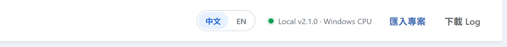

*圖 19：上表最後一列說的「下載 Log」就在網頁右上角這一排。同一排還有語言切換、連線狀態與「匯入專案」；進到某個專案裡之後，這一排還會多出「下載專案」。*

---

## 8. 目前還沒驗證的事

這一節必須誠實地寫清楚，因為它會影響老師能不能放心在課堂上依賴這個功能。

### 8.1 沒有任何一份由這個 Studio 建出來的韌體，曾經被燒進真正的板子裡跑過

已經確實驗證過的，是「編得出來、放得下」：Image、Audio（關鍵字）、Known Sound 三種專案，在 X 板和 GestureAI 板兩塊板子上（合計六種組合），只要你的電腦裝好了真正的 Arm 編譯工具鏈，每次跑測試都會用真正的 `arm-none-eabi-gcc` 重新編譯、連結、檢查大小是否超標，而且確實通過——但如果你的電腦沒裝這個工具鏈，這些測試會安靜地被跳過，不會有任何提示說「這部分沒驗證到」。

**還沒有驗證過的，是「在板子上真的會動」：** 照片會不會真的被拍到、麥克風會不會真的收到聲音、LCD 或 USB 攝影機疊字會不會真的顯示、序列埠會不會真的印出東西、Nu-Link／USB 隨身碟／pyocd 是否真的能把韌體寫進板子——這些全部都還沒有人拿實體板子確認過。具體還沒有驗證的細節包括：GestureAI 第二支麥克風（DMIC1）接腳配置、GestureAI 的 USB 相機加序列埠複合裝置能不能正常列舉、X 板除錯序列埠的接腳配置、沒有背景類別時關鍵字辨識的重新觸發行為、開機等待序列埠連線的 10 秒邏輯、X 板 Known Sound 深度 12 的韌體。

### 8.2 NuMaker-VoiceAI-M55M1 是特別要小心的一塊板子

這塊板子甚至不在自動化測試名單裡。它只有一次人工做過的建置紀錄（沒有使用真正訓練出來的模型，只是為了確認樣板程式碼編譯得過），從來沒有被收進自動測試，重跑測試也不會重新確認它。它的燒錄流程（`setup_voiceai_flash.py`）從來沒有被完整執行過一次——包括那份 Nuvoton 官方裝置描述檔的下載網址，因為開發過程中這份檔案本來就已經在本機了，從來沒有人真的看著它從網路上下載完成過（檔案完整性驗證本身是有效的，只是「網址真的抓得到」這件事沒被實際確認）。**沒有任何由 Studio 產生的韌體曾經寫進過實體的 VoiceAI 板。**（另外要說明一件容易混淆的事：開發過程中，曾經有一個完全獨立、不是這個 Studio 打造也不會被它安裝的驗證小程式，透過除錯線接上一塊實體 VoiceAI 板，確認過那塊板子本身的晶片型號與 NPU 是正常的——這只證明「板子存在且硬體正常」，跟「Studio 建出來的韌體能在上面跑」是兩回事，不要混為一談。）

### 8.3 Known Sound 的深度上限是算出來的，不是量出來的

X 板深度上限 12、GestureAI 與 VoiceAI 上限 11，這幾個數字全部來自「Vela 編譯後的大小加上固定的韌體空間預留，是否小於 2 MiB flash」這個公式計算，**沒有一個是拿板子實際燒錄測出來的**。同一條公式套用在 GestureAI 自己身上其實會算出 12，但目前選擇維持保守的 11；VoiceAI 的 11 也不是公式的答案（公式算出來一樣是 12），而是為了跟 GestureAI 保持一致所做的保守選擇。換句話說，如果之後有人真的拿板子測過深度 12 沒問題，這個上限有可能會再調高——但截至目前，都還沒有人做過這件事。

唯一一次真正做過的「深度 vs 準確率」測試，只用了一組資料（3 個類別、122 個片段、驗證集只有 61 個片段、每類只有 1 次錄音場次）。測試發現深度 9～11 幾乎跟深度 14 一樣準，但深度 12 卻出現不明原因的異常（recall 掉到 0.66，重複三次都一樣）——這正是深度 12 不建議使用的原因。這張表只反映那一組特定資料，不是放諸四海皆準的結論。

### 8.4 沒有被量測過準確率的一般性建議

本手冊裡「資料增強調強一點」「Dropout 調高一點」「多微調一層」這類建議，都是根據程式碼裡的設計意圖與註解寫出來的合理方向，**不是這個專案裡有實際跑過的準確率比較實驗**。除了上面 8.3 提到的那一組 Known Sound 深度測試，以及匯出時 INT8 跟 Float 模型一致率的量測之外，本手冊沒有其他量化過的「調這個參數會讓準確率變好幾個百分點」的證據。請把這些建議當作有根據的方向，不要當作保證。

### 8.5 其他值得知道的落差

- **瀏覽器**：這個工具在驗證階段只確認過 Chrome 可以正常運作；Edge、Firefox 的攝影機與麥克風擷取功能沒有另外被確認過。
- **錄音健檢只在現場錄音時觸發，上傳既有音檔不會觸發**——這跟部分文件描述的「錄音或上傳後都會檢查」不完全一致，請以「現場錄音才會提示」為準。
- **如果 Local Studio 在訓練途中被關掉（當機或手動關閉黑色視窗）**：Image、Audio、Abnormal Sound 專案下次開啟時，還留著的模型檔會被系統偵測到並保留下來；**但 Known Sound 專案目前一律會被標記成訓練失敗**，即使模型檔其實已經寫到硬碟上了，都必須重新按一次訓練。樣本本身在任何情況下都不會遺失。
- **本手冊的截圖只涵蓋瀏覽器裡的畫面**，而且用的是合成出來的示範資料，不是真實教室樣本。命令提示字元視窗（`01_INSTALL.bat`／`02_START.bat` 跑起來的樣子、安裝失敗的訊息）、檔案總管裡的資料夾、開發板實體與 Nu-Link 接線、序列埠終端機的輸出，這一版都還沒有圖，只能照文字描述操作。其中第 6.5 節「板子上會看到什麼」更是連拍都還拍不到——原因見 8.1。

---

如果這份手冊裡的敘述跟你實際看到的畫面不一致，請優先相信畫面上顯示的中文訊息與 `logs\LATEST.log`／`logs\LATEST_INSTALL.log` 的內容，並透過「下載 Log」把診斷檔案交給維護者。
